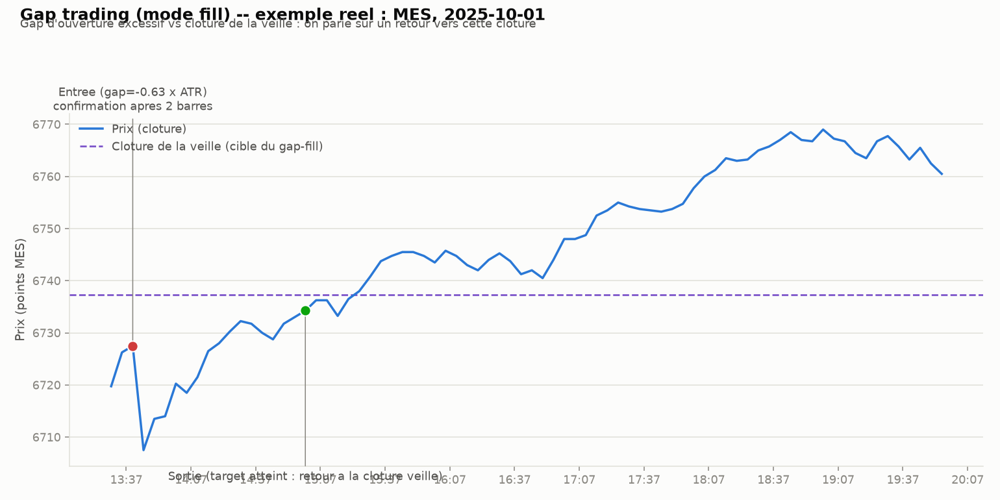

# Gap trading — intraday

## L'idée

À l'ouverture, le prix peut « gaper » par rapport à la clôture de la veille (écart
sans échange entre les deux). Deux paris opposés, testés dans la même grille :

- **Gap-fill (mean-reversion)** : si le gap dépasse un seuil (en multiples d'ATR
  quotidien), on parie que le prix va revenir combler ce gap vers la clôture de la
  veille.
- **Gap-and-go (continuation)** : on parie que le gap continue dans son sens,
  confirmé par la cassure du range des `confirm_bars` premières barres dans la
  direction du gap.

Le signal se décide sur le gap (open du jour vs clôture de la veille — déjà connu
avant la première barre), donc pas de warmup nécessaire comme pour le VWAP.
L'entrée se fait à la clôture de la 1ère ou 2e barre (confirmation), jamais sur
l'open brut, pour éviter un biais d'exécution au prix d'ouverture exact. Un trade
par jour maximum.

## Exemple réel

MES, 1er octobre 2025 (mode gap-fill, barres 5 minutes, séance régulière
09:30–16:00 NY) :

Le prix ouvre bien au-dessus de la clôture de la veille (gap significatif en
multiples d'ATR), la position short est prise après confirmation, puis le prix
revient combler le gap jusqu'à la clôture de la veille — sortie sur target atteint.

## Paramètres testés

- `atr_period` (14) : période de l'ATR quotidien (calculé uniquement sur les
  jours précédents, jamais le jour même).
- `gap_threshold_atr` (0.3 / 0.5 / 0.75) : taille minimale du gap, en multiples
  d'ATR quotidien, pour déclencher un trade.
- `direction` (`fill` / `go`) : les deux branches opposées, testées dans la même
  grille.
- `confirm_bars` (1 / 2) : nombre de barres avant l'entrée (fill) ou taille du
  range de confirmation à casser (go).
- `atr_stop_mult` (0.5 / 1.0) et `atr_target_mult` (1.0 / 2.0) : stop et target en
  multiples d'ATR quotidien (target = clôture de la veille en mode fill).

## Rigueur du backtest (comme pour l'ORB, le VWAP reversion et le pullback)

- Signal basé sur le gap (connu avant l'ouverture) et sur les barres déjà closes ;
  entrée à la clôture d'une barre de confirmation, jamais sur l'open exact — pas de
  fuite de futur. ATR quotidien strictement causal (dépend uniquement des jours
  précédents).
- Coûts et slippage inclus (mêmes hypothèses que les stratégies précédentes —
  100 actions de référence pour SPY/QQQ, 1 contrat pour MES).
- Split in-sample / hors-échantillon (70/30), puis walk-forward (12 mois train /
  3 mois test).
- Test de robustesse contre un benchmark aléatoire (direction tirée à pile ou
  face, même timing, même distance de stop).
- 11 tests unitaires (`test_gap.py`) : pas de fuite de futur sur l'ATR quotidien,
  pas de trade si le gap est trop petit ou l'ATR indisponible, mode fill/go
  correctement déclenchés et non déclenchés, priorité stop > target sur une même
  barre, sortie forcée en fin de séance, bascule correcte de la direction dans le
  test placebo.

## Fichiers

- `gap_backtest.py` — moteur de backtest (ATR quotidien, simulation fill/go,
  grille, walk-forward, test placebo, rapport).
- `test_gap.py` — tests unitaires (11, tous passants).
- `make_example_chart.py` — génère le graphique d'exemple ci-dessus.
- `examples/mes_gap_example.png` — le graphique.
- `download_ib.py` / `download_ib_stock.py` — scripts de téléchargement IB
  (repris tels quels de `vwap_reversion/`) ; les CSV `data/`, `data_spy/`,
  `data_qqq/` sont copiés depuis `vwap_reversion/` (mêmes données, mêmes
  instruments, pour rester comparables).

## Résultats

Grille de 48 configurations, split in-sample (IS) / hors-échantillon (OOS) 70/30,
walk-forward (12 mois train / 3 mois test), test placebo (direction tirée à pile
ou face, même timing, même stop) — sur MES, SPY et QQQ.

| Actif | Meilleure config (IS) | Sharpe IS | Sharpe OOS | Sharpe walk-forward | P-value placebo |
|---|---|---|---|---|---|
| MES | fill, seuil=0.75×ATR, confirm=2, stop=1.0×ATR, target=1.0×ATR | +2.61 | **-1.71** | +1.05 (n=3, non significatif) | **0.814** |
| SPY | fill, seuil=0.75×ATR, confirm=1, stop=0.5×ATR, target=1.0×ATR | +0.44 | +1.13 | -0.02 (n=117) | **0.037** |
| QQQ | fill, seuil=0.5×ATR, confirm=1, stop=0.5×ATR, target=1.0×ATR | +1.35 | -0.08 | -0.28 (n=126) | 0.522 |

Points marquants :

- **MES** : le meilleur Sharpe IS (2.61) s'effondre complètement hors-échantillon
  (-1.71, n=13 trades). Le test placebo est sans appel : p=0.814, c'est-à-dire que
  le gap trading réel fait moins bien que le hasard dans 81 % des simulations sur
  l'OOS. Le walk-forward (n=3 trades) n'est pas exploitable statistiquement.
  → aucun edge sur MES.
- **QQQ** : la meilleure config IS (Sharpe 1.35) redevient quasi plate en OOS
  (-0.08, PF=0.98) et en walk-forward (-0.28). Le test placebo confirme l'absence
  de signal : p=0.522, indiscernable du hasard.
- **SPY** : c'est le cas le plus nuancé. La meilleure config IS tient en OOS
  (Sharpe +1.13, n=26, total +2238$) et le test placebo est significatif
  (p=0.037 — le résultat réel bat le hasard dans 96 % des simulations). Mais le
  **walk-forward**, qui ré-optimise les paramètres tous les 3 mois au lieu de
  figer la config choisie une fois sur l'IS, retombe à un Sharpe quasi nul
  (-0.02, PF=0.99, n=117) : la config gagnante ne se maintient pas d'une fenêtre
  à l'autre. C'est le signe classique d'un résultat qui doit une bonne partie de
  sa performance à une seule fenêtre IS/OOS favorable plutôt qu'à un edge stable
  — la significativité du test placebo (basé sur cette même fenêtre unique) ne
  suffit pas à contredire ce que montre le walk-forward.
- Décomposition par année (SPY, meilleure config, toute la période) : la quasi-
  totalité du gain (+4357$ sur +4512$ au total) provient de 2025 ; 2023 est
  négatif et 2024/2026 sont proches de zéro — cohérent avec un résultat porté par
  une période plutôt que par un mécanisme permanent.
- Sensibilité au slippage : sur les trois actifs, le classement des configs ne
  change pas avec 0 à 3 ticks de slippage — la fragilité vient du signal
  lui-même, pas des coûts de transaction.

**Verdict : stratégie abandonnée.** Aucun edge robuste et cohérent entre actifs :
MES échoue nettement (placebo p=0.814, walk-forward non exploitable), QQQ est
indiscernable du hasard (p=0.522, walk-forward négatif), et SPY — le seul cas où
le test placebo est significatif sur l'OOS — ne résiste pas au walk-forward
(Sharpe quasi nul une fois les paramètres ré-optimisés par fenêtre glissante),
ce qui indique que sa performance OOS tient surtout à une fenêtre favorable
plutôt qu'à un mécanisme stable. Le gap trading, sous cette forme (fill ou go,
seuil ATR, confirmation 1-2 barres), ne passe pas le test de robustesse complet
sur aucun des trois actifs.
