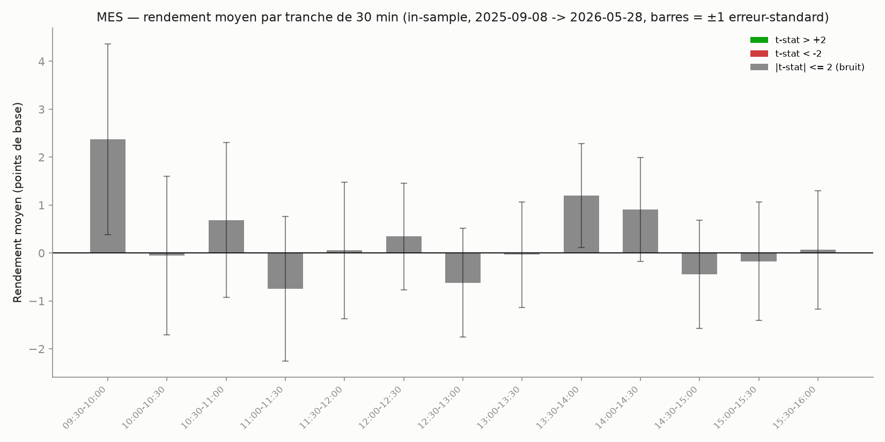

# Saisonnalité intraday

## L'idée

Contrairement aux stratégies précédentes (signal calculé barre par barre), on
teste ici une hypothèse différente : certaines **tranches horaires fixes** de
la séance (09:30-10:00, 10:00-10:30, ..., 15:30-16:00 — tranches de 30
minutes, donc 13 tranches) auraient-elles un rendement moyen directionnel
statistiquement robuste (ex : effacement du gap d'ouverture, dérive de fin de
séance) ?

Deux volets :

1. **Analyse descriptive** : rendement moyen (log open->close de la tranche)
   par tranche, avec t-stat, calculé sur la période in-sample **puis vérifié
   (sans re-sélection) sur la période hors-échantillon**.
2. **Variante backtestable** : si une tranche ressort significative en IS, on
   la trade réellement (entrée à l'ouverture de la tranche, sortie à sa
   fermeture ou sur stop/target en multiples d'ATR quotidien), avec le même
   protocole complet que les autres stratégies (grille, IS/OOS, walk-forward,
   test placebo).

**Attention data snooping (`data_snooping`)** : avec 13 tranches testées, la
probabilité de trouver "la meilleure des 13" par pur hasard est élevée même
sans aucun edge réel. Sous H0 (aucun edge nulle part), le maximum de 13
t-stats indépendants dépasse en général 2 en valeur absolue. Le seuil corrigé
Bonferroni pour un test bilatéral à 5% sur 13 tranches est bien plus strict
qu'un t-stat de 2 isolé — il est calculé et affiché par le script. On exige
donc : (a) un t-stat IS nettement au-delà de ce seuil corrigé, ET (b) une
significativité qui **persiste sur les données hors-échantillon** (même
tranche, jamais re-choisie), avant de considérer qu'il y a un edge réel.

## Exemple réel

Rendement moyen par tranche de 30 minutes sur MES (in-sample, 2025-09-08 →
2026-05-28), avec barres d'erreur ±1 erreur-standard :

Aucune tranche ne dépasse |t-stat| > 2 sur cette période : la plus proche
(09:30-10:00, ouverture) a un t-stat de 1.19, largement dans le bruit compte
tenu des grandes barres d'erreur qui se chevauchent toutes autour de zéro.
C'est déjà un premier signal (visuel) que l'edge, s'il existe, n'est pas
flagrant.

## Paramètres testés

- `slot_minutes = 30` (13 tranches sur la séance de 390 minutes).
- Variante backtestable, sur la tranche retenue en IS :
  - `atr_stop_mult` / `atr_target_mult` : grille incluant "pas de stop/target,
    sortie systématique en fin de tranche" et plusieurs multiples d'ATR
    quotidien (calculé sur les 20 jours **précédents**, jamais le jour même).
  - `direction` : déterminée par le signe du rendement moyen IS de la tranche
    choisie (pas un paramètre libre).

## Rigueur du backtest (comme l'ORB, le VWAP reversion, le pullback, le gap trading, le squeeze, le breakout volume et le pairs trading)

- **Rendement de tranche 100% causal** : ne dépend que des barres appartenant
  à cette tranche (open de la 1ère barre, close de la dernière) ; un test
  dédié vérifie qu'une modification d'une barre d'une autre tranche ne change
  pas le rendement calculé (`test_slot_returns_only_uses_bars_within_the_slot`).
- **Sélection de la tranche basée uniquement sur les dates d'entraînement** :
  `select_best_slot` ne reçoit jamais les dates de test — vérifié par un test
  dédié où le train et le test sont biaisés sur des tranches différentes
  (`test_select_best_slot_uses_only_training_dates_never_test_dates`) : la
  sélection doit retomber sur la tranche du train, jamais celle du test.
- **ATR quotidien jamais calculé sur le jour même** : moyenne des ranges des
  20 jours strictement précédents (`test_compute_daily_atr_uses_only_prior_days`).
- **Exécution réaliste** : entrée à l'ouverture de la tranche + slippage,
  sortie à la clôture de la tranche + slippage (ou sur stop, détecté sur les
  clôtures des barres de la tranche et exécuté à l'ouverture de la barre
  suivante + slippage).
- Correction multiple-testing explicite (seuil Bonferroni affiché) et
  vérification de persistance hors-échantillon avant toute conclusion — pas
  seulement "la meilleure des 13".
- Split in-sample / hors-échantillon (70/30), puis walk-forward (12 mois
  train / 3 mois test, **avec re-sélection de la tranche à chaque fenêtre
  d'entraînement**, jamais sur la fenêtre de test).
- Test de robustesse contre un benchmark aléatoire (direction tirée à pile ou
  face, même tranche, même timing).
- 10 tests unitaires (`test_seasonality_backtest.py`) : calcul du rendement de
  tranche sur un jeu de données à valeurs connues, absence de fuite entre
  tranches, sélection de tranche qui retrouve la bonne tranche biaisée sur des
  données construites, sélection basée uniquement sur le train, cohérence
  moyenne/t-stat avec un calcul manuel, entrée/sortie de la variante
  backtestable aux bons horaires, déclenchement du stop sur mouvement adverse,
  déterminisme du test placebo à seed fixée, ATR causal, colonnes de sortie du
  backtest correctes.

## Fichiers

- `seasonality_backtest.py` — moteur (rendements par tranche, t-stats,
  sélection IS-only, variante backtestable, grille, walk-forward, placebo,
  rapport).
- `test_seasonality_backtest.py` — tests unitaires (10, tous passants).
- `make_example_chart.py` — génère le graphique d'exemple ci-dessus.
- `examples/seasonality_slots_mes.png` — le graphique.
- `download_ib.py`, `download_ib_stock.py` — scripts de téléchargement IB
  (repris tels quels de `vwap_reversion/`) ; les CSV `data/`, `data_spy/`,
  `data_qqq/` sont copiés depuis `vwap_reversion/` (mêmes données, mêmes
  instruments, pour rester comparables).

## Résultats

Analyse sur MES (258 jours, 2025-09 → 2026-09), SPY et QQQ (756 jours chacun,
2023-09 → 2026-09), split IS/OOS 70/30, walk-forward (12 mois train / 3 mois
test, tranche re-choisie à chaque fenêtre), test placebo.

### 1. Analyse descriptive : aucune tranche significative

| Instrument | Meilleure tranche (IS) | \|t-stat\| IS | Seuil Bonferroni (13 tranches, 5%) | t-stat OOS (même tranche) |
|---|---|---|---|---|
| MES | 09:30-10:00 | 1.19 | 2.89 | 0.16 |
| SPY | 13:30-14:00 | 1.59 | 2.89 | 0.74 |
| QQQ | 13:30-14:00 | 1.54 | 2.89 | 0.91 |

**Sur les 3 instruments, aucune tranche n'atteint ne serait-ce que |t-stat| =
2 en in-sample**, très loin du seuil Bonferroni requis (2.89) pour corriger le
test sur 13 fenêtres. C'est exactement le comportement attendu sous
l'hypothèse nulle (aucun edge réel nulle part) : avec 13 tests, il est normal
qu'une tranche atteigne un t-stat autour de 1.2-1.6 par pur hasard — c'est du
bruit, pas un signal. Les t-stat OOS de ces mêmes tranches sont encore plus
proches de zéro, confirmant l'absence de persistance.

### 2. Variante backtestable (tranche la plus prometteuse en IS, tradée quand même pour vérification)

| Instrument | Sharpe IS | Sharpe OOS | Sharpe walk-forward | P-value placebo (OOS) |
|---|---|---|---|---|
| MES (09:30-10:00) | 0.69 | -0.34 | -4.04 (n=9) | 0.465 |
| SPY (13:30-14:00) | 0.45 | 0.13 | -0.99 (n=506) | 0.223 |
| QQQ (13:30-14:00) | 0.46 | 0.44 | -0.19 (n=506) | 0.153 |

Points marquants :

- Même en tradant réellement la tranche la plus prometteuse trouvée en IS
  (biais de sélection favorable au maximum), le Sharpe IS reste modeste
  (0.45-0.69, t-stat 0.6-0.8, non significatif) et **s'effondre ou stagne en
  walk-forward** sur les 3 instruments (-4.04, -0.99, -0.19).
- **Aucun test placebo ne rejette** (p entre 0.153 et 0.465) : la direction
  réelle du pari ne fait pas mieux que pile ou face sur la période
  hors-échantillon, pour aucun des 3 instruments.
- Sensibilité au slippage : le résultat le plus favorable (0 tick, optimiste)
  s'effondre déjà à 1-2 ticks de slippage réaliste pour MES et devient
  marginal pour SPY/QQQ (Sharpe proche de 0 à 2 ticks).
- Le grid stop/target ATR ne change rien aux résultats car aucun stop
  n'a jamais été touché avant la fin de la tranche de 30 minutes sur ces
  configurations — les métriques sont identiques quel que soit le
  stop/target testé, signe que la volatilité intra-tranche reste sous les
  seuils testés.

**Verdict : aucun edge de saisonnalité intraday détecté.** Sur MES, SPY et
QQQ, aucune des 13 tranches horaires ne dépasse le seuil de significativité
corrigé pour tests multiples (Bonferroni), et la meilleure tranche
apparente en in-sample ne persiste pas hors-échantillon (t-stat OOS proche de
zéro), ne survit pas au walk-forward (Sharpe négatif ou quasi nul) et ne
rejette aucun test placebo. C'est le résultat attendu compte tenu du risque de
data snooping sur 13 fenêtres testées : sans cette rigueur (Bonferroni +
persistance OOS + placebo), il aurait été tentant de conclure à tort à un edge
sur la tranche 13:30-14:00 (t-stat IS ~1.5-1.6 sur SPY/QQQ), alors qu'il s'agit
de bruit statistique normal.
