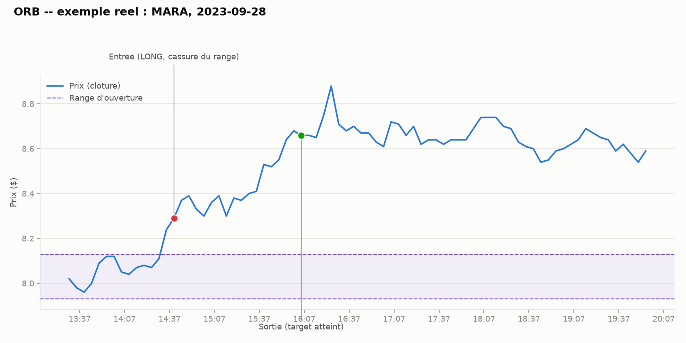

# ORB sur small/mid-caps

## L'idée

L'ORB (Opening Range Breakout) a déjà été testé sur MES (future indice) et
SPY/QQQ (grands ETF) et n'a montré aucun edge exploitable après coûts (cf.
`breakout_opening/README.md`, `vwap_reversion/`). Hypothèse : ces marchés
sont si liquides et arbitrés (market makers, HFT) que le signal de cassure de
range est immédiatement digéré par le prix. On teste donc **le même moteur
ORB, sans aucune modification de la logique**, sur des instruments moins
efficients : un ETF small-cap (IWM), un ETF sectoriel bancaire régional plus
volatil que SPY/QQQ (KRE), et 6 actions individuelles mid/small-cap réputées
pour leur forte volatilité intraday (SOFI, PLUG, MARA, RIOT, AFRM, UPST).

Règles identiques à l'ORB de référence :
1. Range d'ouverture = plus haut/plus bas des `or_minutes` premières minutes.
2. Première clôture hors du range → signal dans le sens de la sortie.
3. Entrée à l'ouverture de la barre suivante + slippage.
4. Stop à l'autre bord du range (ou au milieu), objectif optionnel en
   multiple du risque.
5. Sortie forcée en fin de séance. Un trade par jour maximum.

## Exemple réel

MARA, 28/09/2023 : range d'ouverture (violet), cassure vers le haut suivie
d'une entrée long, sortie sur objectif atteint (1.5R).

## Paramètres testés

Identiques à l'ORB de référence :
- `or_minutes` (15 / 30 / 60)
- `stop_mode` (opposite / mid)
- `target_r` (aucun / 1.0 / 1.5 / 2.0)

24 configurations par ticker.

## Rigueur du backtest (comme toutes les stratégies précédentes)

- **Aucune modification du moteur ORB** : seul le dictionnaire `INSTRUMENTS`
  est étendu (tick=0.01, point_value=100.0 pour 100 actions de référence,
  comme SPY/QQQ) — même code, même logique, pour une comparaison directe et
  honnête avec les résultats déjà obtenus sur MES/SPY/QQQ.
- Signal à la clôture, exécution à l'ouverture de la barre suivante +
  slippage ; stop/target figés au moment du signal.
- 13 tests unitaires déjà existants et vérifiés verts sur ce nouveau dossier
  (`test_orb_backtest.py`, repris tel quel de `breakout_opening/`).
- Split in-sample / hors-échantillon (70/30), walk-forward (12 mois train /
  3 mois test), test placebo (direction aléatoire), sensibilité au slippage
  (0-3 ticks).
- **Attention data snooping multi-tickers** : tester 8 tickers en parallèle
  augmente le risque de "trouver" un edge sur l'un d'eux par hasard. Un
  ticker isolé qui ressort positif sera jugé avec la même exigence que la
  saisonnalité intraday (persistance OOS + walk-forward + placebo, pas
  seulement un résultat IS favorable).

## Fichiers

- `orb_backtest.py` — moteur (identique à `breakout_opening/`, instruments
  actions/ETF ajoutés).
- `test_orb_backtest.py` — tests unitaires (13, repris de `breakout_opening/`).
- `make_example_chart.py` — génère un graphique d'exemple pour un ticker donné.
- `download_ib_stock.py` — téléchargement IB (repris de `pairs_trading/`).
- `data/<TICKER>_5min_all.csv` — historiques 5 minutes, 3 ans, séance
  régulière US.

## Résultats

**Statut** : les 8 tickers ont été backtestés (IWM, SOFI, PLUG, MARA, RIOT,
AFRM, UPST, KRE, ~3 ans de données 5 min chacun). Le téléchargement d'AFRM/
UPST/KRE a connu une interruption transitoire de connectivité TWS en cours de
route ("Error 1100" suivi d'un "Error 1102" de reconnexion automatique
quelques secondes après) mais s'est terminé sans intervention manuelle.

Pour chaque ticker : meilleure config choisie en in-sample (grille de 24
configurations), puis évaluée en hors-échantillon (30% final) et en
walk-forward (12 mois train / 3 mois test). "Placebo" = p-value du test
direction aléatoire sur la période hors-échantillon.

| Ticker | Sharpe IS | Sharpe OOS | Sharpe walk-forward | p-value placebo |
|---|---|---|---|---|
| IWM  |  0.32 | -0.59 | -0.71 | 0.781 |
| SOFI | -1.93 | -1.13 | -1.73 | 0.312 |
| PLUG | -4.71 | -8.16 | -7.02 | 0.784 |
| MARA |  0.26 | -1.86 | -1.76 | 0.518 |
| RIOT | -0.58 | -1.18 | -2.26 | 0.635 |
| AFRM |  0.93 | -0.43 |  0.62 | 0.462 |
| UPST | -0.07 | -1.99 | -1.41 | 0.844 |
| KRE  | -1.02 | -0.76 | -1.61 | 0.382 |

Aucun ticker ne montre d'edge exploitable :
- Seuls IWM, MARA et AFRM ont un Sharpe in-sample positif ; les cinq autres
  (SOFI, PLUG, RIOT, UPST, KRE) sont négatifs dès l'in-sample.
- **Aucun** des 8 tickers n'a de Sharpe positif hors-échantillon, ni en
  walk-forward (AFRM s'en approche avec un walk-forward à 0.62, mais via une
  succession de configs différentes par fenêtre plutôt qu'un gagnant stable,
  et son OOS reste négatif à -0.43) — la config "gagnante" en IS ne survit
  quasiment jamais à l'épreuve du temps, ce qui est le signe classique d'un
  résultat IS obtenu par sur-ajustement sur la grille de 24 configs plutôt
  qu'un edge réel (risque de data snooping accru ici avec 8 tickers testés en
  parallèle, cf. section rigueur ci-dessus).
- Le test placebo ne rejette jamais l'hypothèse nulle (p-value la plus basse
  = 0.312 pour SOFI, très loin du seuil 0.05) : la performance hors-échantillon
  de l'ORB n'est statistiquement pas différente d'un pari à direction
  aléatoire avec le même timing et le même stop.
- PLUG est un cas particulier : Sharpe très négatif et stable (IS, OOS,
  walk-forward tous < -4), pire qu'aléatoire (p-value placebo 0.784, c'est
  la direction aléatoire qui fait presque aussi mal que l'ORB, pas mieux).
  Cela ne signale pas un edge inversé exploitable — l'échantillon est trop
  spécifique (une action en forte tendance baissière structurelle sur la
  période) pour en tirer une conclusion générale ; plutôt un rappel que sur
  des small-caps très volatiles, les faux signaux de cassure (range étroit,
  volatilité intrajournalière élevée) coûtent cher en stops.

**Verdict** : comme sur MES/SPY/QQQ, l'ORB ne montre aucun edge exploitable
sur ces 8 small/mid-caps une fois les coûts, le split IS/OOS, le
walk-forward et le test placebo appliqués avec la même rigueur. Changer
d'instrument (vers des actions moins liquides/moins efficientes) n'a pas
suffi à faire apparaître un edge pour cette stratégie précise — l'ORB en
lui-même (range d'ouverture + cassure) semble ne pas capturer de
biais directionnel robuste, quel que soit le marché testé jusqu'ici. Ce
dossier est considéré clos.
