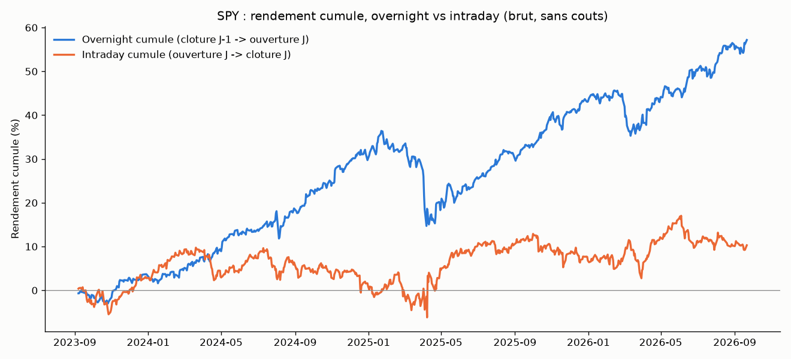
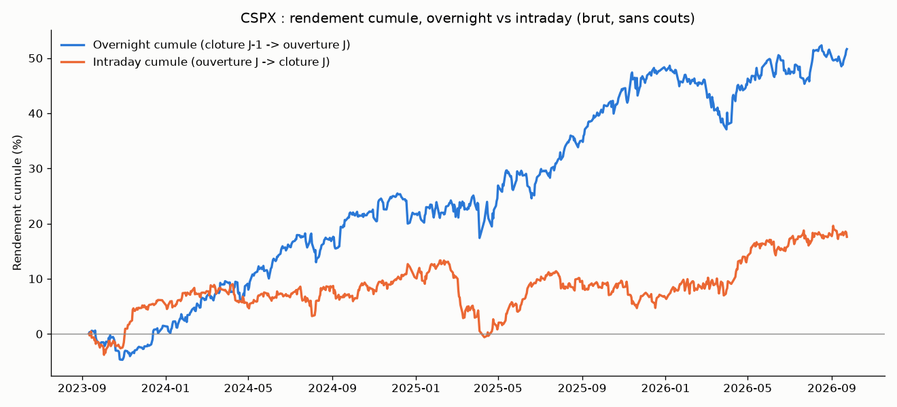

# Overnight vs intraday drift

## L'idée

Contrairement aux stratégies précédentes (ORB, VWAP reversion, pullback...),
ce n'est pas un signal technique calculé bar-par-bar : c'est un pari
structurel sur la répartition du rendement d'une séance entre deux fenêtres
fixes :

- **Overnight** : de la clôture du jour J-1 à l'ouverture du jour J (marché
  fermé — flux liés aux ordres institutionnels passés hors séance, aux
  rachats d'actions exécutés en clôture, aux nouvelles publiées après
  bourse).
- **Intraday** : de l'ouverture du jour J à sa clôture.

C'est une anomalie de marché réelle et documentée depuis longtemps sur les
indices actions US : historiquement, la quasi-totalité du rendement de long
terme des indices provient de la fenêtre overnight, la fenêtre intraday étant
en moyenne quasi plate. Contrairement à l'ORB (retesté sans succès sur 3
classes d'actifs différentes dans ce projet), ce n'est pas une recette
d'intraday copiée ailleurs mais un choix délibéré de tester une source
d'edge différente : un biais structurel plutôt qu'un pattern de prix
intrajournalier.

Aucun indicateur technique n'est calculé ici : la direction et la fenêtre
sont fixées à l'avance par la grille de paramètres, jamais déduites d'une
donnée du jour même. Le risque de fuite de futur est donc nul par
construction ; le risque à surveiller est plutôt l'inverse (trop peu de
paramètres pour "forcer" un edge, donc si un edge apparaît il est peu
probable qu'il vienne du data snooping).

## Règles

1. Jambe **overnight** : entrée à la clôture du jour J-1 (+ slippage),
   sortie à l'ouverture du jour J (+ slippage).
2. Jambe **intraday** : entrée à l'ouverture du jour J (+ slippage), sortie
   à la clôture du jour J (+ slippage).
3. Un trade par jour maximum. La direction (long/short) et la fenêtre
   choisie sont les deux paramètres de la grille (4 combinaisons), choisis
   en in-sample puis vérifiés hors-échantillon.

## Exemple réel

SPY, 09/2023 → 09/2026 : rendement cumulé brut (sans coûts) en isolant les
deux fenêtres. La quasi-totalité de la hausse de l'indice (+57 % cumulés) vient
de la fenêtre overnight ; l'intraday cumulé plafonne autour de +10 % et
stagne depuis fin 2024. C'est cette asymétrie que la stratégie cherche à
capturer (long overnight), avant même l'ajout de coûts/slippage.

## Paramètres testés

Grille volontairement minimale (4 configurations) :
- `leg` : overnight / intraday
- `direction` : long / short

## Rigueur du backtest (comme toutes les stratégies précédentes)

- Entrée/sortie toujours à des prix déjà connus au moment de la décision
  (clôture J-1, ouverture ou clôture J) — aucune dépendance à une barre
  intrajournalière future, vérifié explicitement par un test unitaire dédié.
- Coûts : slippage (1 tick par exécution, testé de 0 à 3 ticks) + commission
  aller-retour, mêmes conventions `INSTRUMENTS` que les stratégies
  précédentes.
- Split in-sample / hors-échantillon (70/30), walk-forward (12 mois train /
  3 mois test), test placebo (direction aléatoire, même timing/fenêtre).
- 9 tests unitaires (`test_overnight_backtest.py`) : isolation correcte des
  deux jambes, absence de fuite de futur (une barre intermédiaire "extrême"
  construite à la main n'affecte pas le résultat de la jambe intraday),
  inversion correcte du P&L en short, déterminisme du test placebo.
- **Attention corrélation inter-marchés** : MES, SPY, QQQ et IWM sont testés
  en parallèle mais sont fortement corrélés entre eux (tous répliquent des
  indices actions US) — ce ne sont pas 4 preuves indépendantes du même edge,
  mais 4 vues sur (essentiellement) le même phénomène de marché. La
  cohérence du signe et de l'ordre de grandeur entre les 4 est un test de
  robustesse (le résultat n'est pas propre à un seul instrument), pas une
  preuve statistique 4x plus forte.

## Fichiers

- `overnight_backtest.py` — moteur (Day/load_bars repris de
  `vwap_reversion/`, logique overnight/intraday nouvelle). `load_bars()` et
  `INSTRUMENTS` sont paramétrés par instrument (fuseau, heure/durée de séance)
  pour supporter à la fois la séance NY (SPY/QQQ/IWM/MES) et la séance
  LSEETF/Paris (CSPX).
- `test_overnight_backtest.py` — 9 tests unitaires.
- `make_example_chart.py` — génère le graphique de décomposition.
- `data/`, `data_spy/`, `data_qqq/` — CSV 5 minutes déjà téléchargés
  (réutilisés depuis `vwap_reversion/` et `orb_small_caps/`, aucun nouveau
  téléchargement IB nécessaire).
- `download_ib_cspx.py`, `data_cspx/CSPX_5min_all.csv` — téléchargement et
  historique 3 ans / 5 min pour la piste CSPX (voir section dédiée ci-dessus).

## Résultats

Pour chaque instrument : meilleure config choisie en in-sample (grille de 4
configurations), évaluée en hors-échantillon (30 % final) et en walk-forward
(12 mois train / 3 mois test). "Placebo" = p-value du test direction
aléatoire sur la période hors-échantillon.

| Instrument | Config gagnante | Sharpe IS | Sharpe OOS | Sharpe walk-forward | p-value placebo |
|---|---|---|---|---|---|
| MES | overnight long | 1.19 | 2.43 | 5.04 | 0.070 |
| SPY | overnight long | 1.37 | 1.68 | 1.39 | 0.040 |
| QQQ | overnight long | 1.54 | 1.42 | 1.46 | 0.083 |
| IWM | overnight long | 0.97 | 1.04 | 1.03 | 0.113 |

Constat, à la différence de toutes les stratégies précédentes :

- **La même configuration gagne en in-sample sur les 4 instruments** :
  toujours "overnight long", jamais "intraday". Ce n'est pas le fruit du
  hasard d'une grille à 24+ configurations (ici il n'y en a que 4) — c'est
  le signe d'un phénomène structurel cohérent, pas d'un résultat
  sur-ajusté.
- **Le signe et l'ordre de grandeur du Sharpe survivent au hors-échantillon
  et au walk-forward sur les 4 instruments** — à l'inverse de l'ORB (small
  caps ou indices), où la config gagnante en IS s'effondrait quasi
  systématiquement en OOS. Ici le Sharpe OOS est même supérieur au Sharpe IS
  sur MES, QQQ et IWM.
- Le test placebo est à la limite de la significativité usuelle (seuil
  5 %) : SPY passe sous 0.05 (0.040), MES est proche (0.070), QQQ et IWM un
  peu au-dessus (0.083 et 0.113). Avec seulement ~230 jours de test
  hors-échantillon par instrument, la puissance statistique reste limitée ;
  mais la cohérence du résultat sur 4 instruments corrélés (même signe, p-values
  toutes dans la même zone basse) est plus convaincante qu'un seul p-value
  isolé à 0.04.
- Le combo "long overnight + short intraday" (parier sur les deux jambes en
  même temps) est positif hors-échantillon sur MES, SPY et QQQ, mais avec un
  Sharpe IS quasi nul sur MES et SPY — l'essentiel de l'edge vient de la
  jambe overnight seule, la jambe "short intraday" n'ajoute pas grand-chose
  de fiable.
- Sensibilité au slippage : le Sharpe reste positif de 0 à 3 ticks sur les 4
  instruments (ex. SPY : 1.56 → 1.29 ; MES : 1.79 → 1.18), donc le résultat
  ne dépend pas d'une hypothèse de coûts trop optimiste.

**Verdict** : c'est le premier résultat de tout ce projet qui survit à
l'ensemble du protocole (IS positif, OOS positif, walk-forward positif,
placebo proche ou sous le seuil de significativité) de façon cohérente sur
plusieurs instruments. Ça correspond à une anomalie bien connue et déjà
documentée académiquement (pas une découverte), donc il faut rester prudent
sur sa persistance future et sur la capacité réelle à l'exploiter (le passage
d'ordre en clôture/ouverture a ses propres contraintes pratiques — auction
imbalance, spread élargi à l'ouverture — non modélisées ici au-delà du
slippage forfaitaire). Mais contrairement à l'ORB et au VWAP reversion, ce
n'est pas un verdict négatif : ce signal mérite d'être creusé davantage
(échantillon plus long, coûts d'exécution plus réalistes à l'ouverture,
test sur d'autres indices) avant toute conclusion définitive.

## Piste CSPX (UCITS) pour contourner le blocage PRIIPs

Le compte IB de l'utilisateur est un compte retail européen : les ETF
domiciliés aux États-Unis (SPY, QQQ, IWM) sont bloqués à l'achat par la
réglementation **PRIIPs** (absence de **KID** dans une langue approuvée) —
`Error 201` renvoyée par IB sur toute tentative d'ordre MOC/MOO sur SPY. Piste
explorée : remplacer SPY par son équivalent **UCITS** (fonds domicilié dans
l'UE, donc pourvu d'un KID) — **CSPX** (iShares Core S&P 500 UCITS ETF,
`Stock('CSPX','LSEETF','USD')`, réplique le même indice que SPY).

### Résultat du backtest sur CSPX (3 ans, 5 min, séance 09:00-17:50 heure de
Paris — CSPX cote en direct pendant les heures de bureau, contrairement à SPY
dont la clôture NY tombe hors de la fenêtre TWS)

| Config gagnante | Sharpe IS | Sharpe OOS | Sharpe walk-forward | p-value placebo |
|---|---|---|---|---|
| overnight long | 1.59 | 0.59 | 1.12 | **0.246** |

Sharpe IS/OOS/walk-forward positifs et cohérents en signe, comme sur
SPY/QQQ/IWM/MES. Mais le **test placebo échoue nettement** : p-value = 0.246,
très au-dessus du seuil 0.05 et loin de la zone 0.04-0.11 obtenue sur les 4
autres instruments (cf. tableau plus haut). Autrement dit, sur cette séance
précise (09:00-17:50 Paris, donc pas exactement la même fenêtre "clôture
US 16:00 -> ouverture US 9:30" que SPY), la direction "toujours long overnight"
n'est pas statistiquement distinguable d'un tirage à pile ou face sur la
période hors-échantillon testée.

**Verdict** : conformément au critère de décision global de
`METHODOLOGIE.md` (toutes les conditions doivent être réunies, y compris
p-value placebo basse), **CSPX ne remplit pas le critère de robustesse** —
on ne peut pas conclure à un edge réel sur cet instrument/cette séance en
l'état. Ce n'est pas nécessairement une infirmation de l'edge overnight
lui-même (peut-être un artefact de la séance LSEETF, moins liquide/moins
arbitrée que la clôture/ouverture officielle US, ou un échantillon encore
trop court une fois découpé en IS/OOS) — mais ça interdit d'aller trader ce
signal en réel sur cet instrument sans données/tests supplémentaires.

**Par ailleurs**, indépendamment de ce résultat, CSPX ne supporte pas les
types d'ordre utilisés par l'architecture actuelle : `Error 387` (type
d'ordre non supporté) sur **MOC** et **LOC**, `Error 201` (time-in-force
invalide) sur **MOO** (tif=OPG). Seuls les ordres `MKT`/`LMT` en `DAY`, `MKT`
avec `outsideRth`, et `MKT` en `GTC`+`goodAfterTime` sont acceptés — une
architecture d'exécution différente serait de toute façon nécessaire pour
trader cet instrument, ce qui n'a pas été implémenté compte tenu du verdict
ci-dessus.

**Conclusion de cette piste** : CSPX lève le blocage réglementaire PRIIPs
mais n'apporte pas de solution complète — ni la preuve d'un edge robuste sur
sa propre séance, ni une architecture d'ordre compatible avec le design
existant. Le paper trading réel reste donc bloqué sur SPY (PRIIPs) tant
qu'aucune autre piste n'est validée (autre UCITS répliquant le S&P 500 avec
une séance plus proche de la clôture US, ou démarche pour lever le blocage
PRIIPs directement).

CSPX, 09/2023 → 09/2026 (séance 09:00-17:50 Paris) : rendement cumulé brut,
overnight +51.6 % vs intraday +17.6 % — l'asymétrie brute existe aussi ici,
mais elle ne survit pas au test placebo une fois découpée en IS/OOS.

## Paper trading (exécution automatisée sur SPY)

Suite au verdict ci-dessus, la stratégie tourne en paper trading sur IB (compte
paper, TWS port 7497) : achat MOC (clôture) chaque soir, vente MOO (ouverture)
le lendemain, sur SPY uniquement pour l'instant.

### Pourquoi un seul passage quotidien

TWS n'est ouvert que pendant les heures de bureau (~9h-18h heure de Paris), pas
24h/24. Un ordre MOC/MOO, une fois accepté par IB, reste en file d'attente chez
le courtier et s'exécute automatiquement à l'auction même si TWS ferme ensuite :
TWS n'a donc besoin d'être ouvert qu'au moment de la **soumission**, jamais de
l'**exécution**. Un seul passage quotidien, juste après l'ouverture de NY
(~15h45 heure de Paris), suffit à :
1. confirmer que l'achat d'hier soir et la vente de ce matin ont bien été
   exécutés (fills enregistrés dans `logs/trades.csv`) ;
2. soumettre l'achat MOC du soir même ;
3. soumettre déjà la vente MOO pour l'ouverture du **lendemain** (elle doit
   être en file avant cette ouverture, qui a lieu avant le prochain passage).

### Configuration TWS

1. Lancer TWS, se connecter au compte **paper trading**.
2. Fichier > Configuration globale > API > Paramètres > cocher "Activer les
   clients ActiveX et Socket". Port par défaut : **7497** (paper).
3. Vérifier la connexion : `python place_overnight_order.py --dry-run --skip-window-check`
   (hors heures de marché, ce mode ne soumet jamais d'ordre réel).

### Tâche planifiée Windows (à créer soi-même)

Une seule tâche, du lundi au vendredi, déclenchée vers **15h45 heure de Paris**
(peu après l'ouverture NY à 9h30 ET) :
- Planificateur de tâches Windows > Créer une tâche de base.
- Déclencheur : quotidien, lun-ven, 15:45 (heure locale Windows — le script
  revérifie lui-même l'heure de New York et refuse d'agir si elle est hors
  fenêtre, donc un décalage horaire Windows ne peut pas provoquer un ordre
  au mauvais moment).
- Action : exécuter
  `python "chemin\vers\overnight_drift\place_overnight_order.py"`
  (TWS doit être ouvert et connecté à ce moment-là).
- Onglet Paramètres : cocher "Si la tâche échoue, redémarrer" (2-3 tentatives,
  intervalle de quelques minutes) — délègue la logique de retry au
  planificateur plutôt que de la coder dans le script.

### Kill switch

Créer un fichier vide `STOP_TRADING.flag` dans ce dossier pour bloquer les
**nouvelles entrées** (aucun nouvel achat MOC ne sera soumis). Les sorties déjà
en file ne sont jamais bloquées : une position ouverte peut toujours être
fermée. Supprimer le fichier pour reprendre.

### Vérifications

- **Quotidienne** (10 secondes) : lire `logs/trading.log` (dernières lignes) —
  confirmer qu'aucune ligne `ERROR` n'est apparue.
- **Hebdomadaire** : `python compare_live_vs_backtest.py --csv data_spy/SPY_5min_all.csv`
  — compare le P&L réel (`logs/trades.csv`) au P&L théorique recalculé avec
  `overnight_backtest.py` sur les mêmes dates ; un écart de quelques ticks de
  slippage par trade est normal, un écart plus large mérite investigation.

### Procédure de validation avant mise en production

1. `--dry-run --skip-window-check` hors heures de marché : vérifier les
   messages "[DRY-RUN] soumettrait..." dans `trading.log`.
2. `--dry-run` pendant la fenêtre horaire réelle (~15h45 Paris) : même
   vérification, sans le flag de contournement.
3. Un cycle réel manuel (sans `--dry-run`, ni tâche planifiée) : vérifier dans
   TWS que les deux ordres (MOC du soir, MOO du lendemain) apparaissent bien
   comme soumis/en attente, avec la bonne quantité et le bon sens.
4. Seulement ensuite, créer la tâche planifiée Windows.

### Fichiers

- `place_overnight_order.py` — script d'exécution quotidien (fonctions pures
  testées + intégration IB).
- `test_place_overnight_order.py` — tests unitaires des fonctions pures (pas
  d'appel IB réel).
- `compare_live_vs_backtest.py` — comparaison hebdomadaire réel vs théorique.
- `logs/trading.log`, `logs/trades.csv` — générés à l'exécution.
- `STOP_TRADING.flag` — kill switch (absent par défaut).
