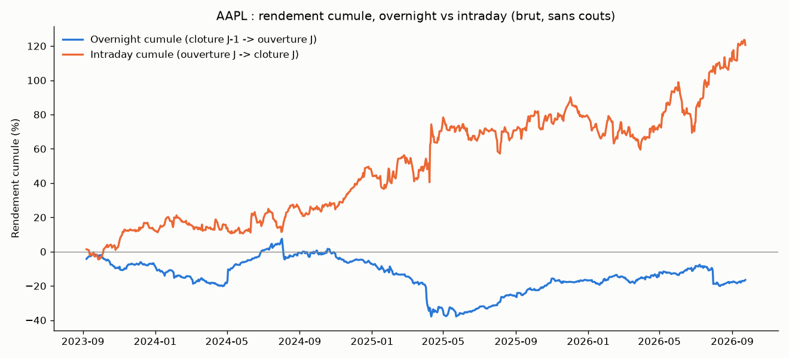
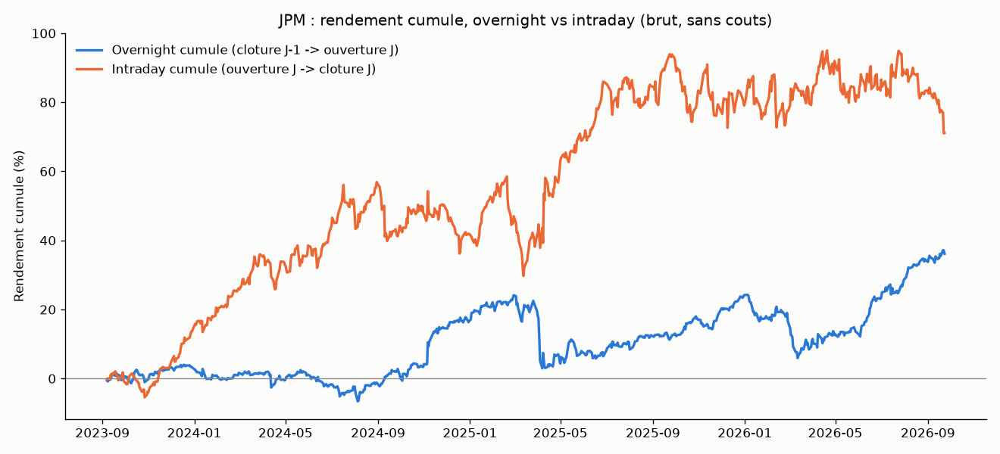
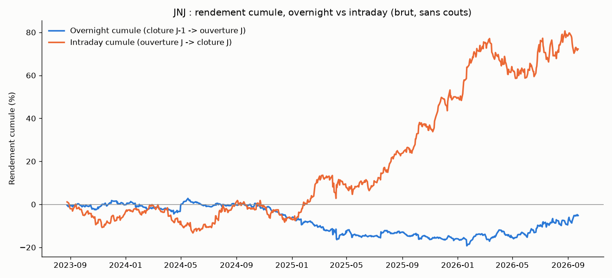
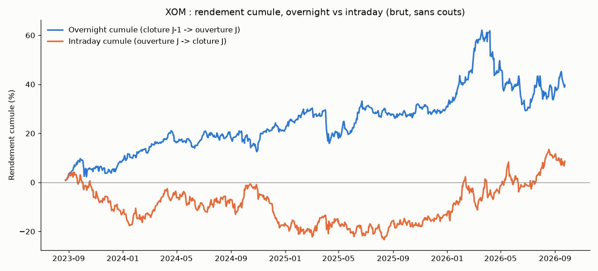
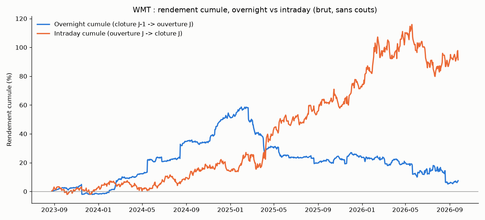
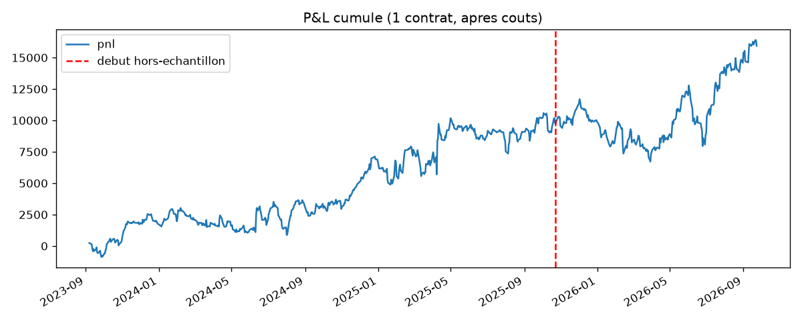
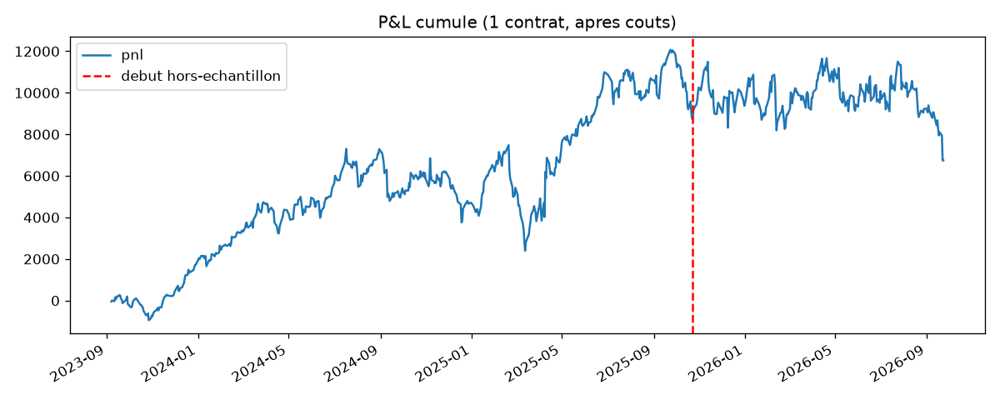
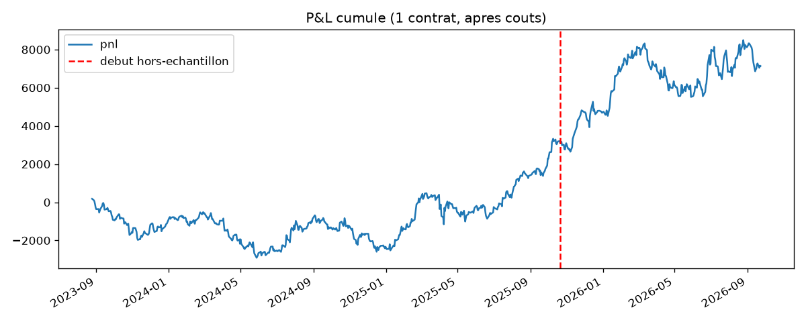
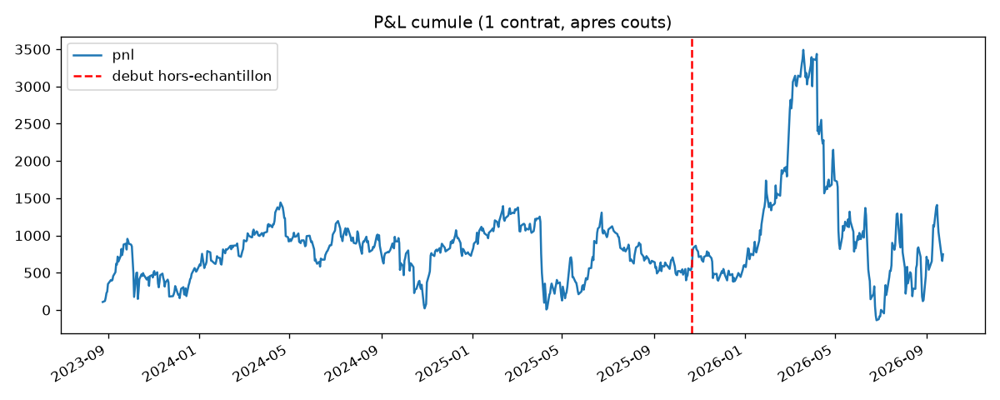
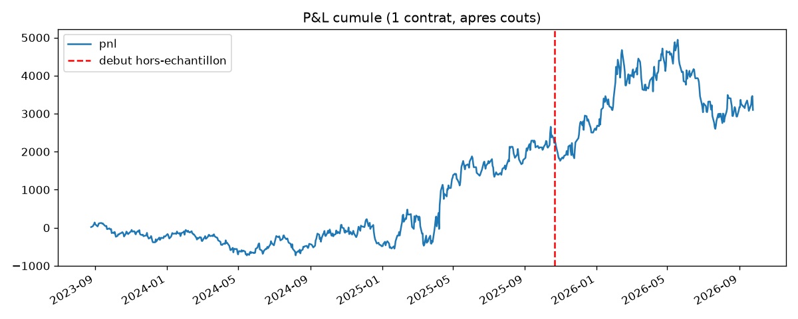

# Overnight drift sur actions individuelles (AAPL, JPM, JNJ, XOM, WMT)

## L'idée

`overnight_drift/` (indices/ETF : MES, SPY, QQQ, IWM, CSPX) est la seule
stratégie du projet à avoir survécu à l'ensemble du protocole. Question
naturelle : ce biais structurel (le rendement de long terme vient
essentiellement de la fenêtre clôture → ouverture, marché fermé) se
retrouve-t-il aussi sur des **actions individuelles** plutôt que sur des
paniers larges (indices) ? Ce dossier reteste exactement la même logique —
même moteur, même grille de 4 configurations (jambe overnight/intraday ×
direction long/short) — sur 5 méga-caps US de secteurs différents pour
répondre à cette question, et accessoirement contourner le blocage PRIIPs qui
touche SPY/QQQ/IWM sur un compte IB retail européen (les actions US ne sont
pas concernées, contrairement aux ETF domiciliés aux États-Unis).

Tickers choisis pour couvrir des secteurs peu corrélés entre eux (contrairement
à MES/SPY/QQQ/IWM qui répliquent tous des indices actions US) :
**AAPL** (tech), **JPM** (finance), **JNJ** (santé), **XOM** (énergie),
**WMT** (consommation courante).

## Règles

Identiques à `overnight_drift/` :
1. Jambe **overnight** : entrée à la clôture du jour J-1 (+ slippage), sortie
   à l'ouverture du jour J (+ slippage).
2. Jambe **intraday** : entrée à l'ouverture du jour J (+ slippage), sortie à
   la clôture du jour J (+ slippage).
3. Un trade par jour maximum. Direction et fenêtre = les 2 paramètres de la
   grille (4 combinaisons), choisis en in-sample puis vérifiés hors-échantillon.

## Exemples réels (décomposition overnight vs intraday, brut sans coûts)

Contrairement à SPY (où l'essentiel de la hausse cumulée vient de la fenêtre
overnight), ici c'est l'inverse sur 4 des 5 titres : AAPL (+120,6 % intraday
vs -16,5 % overnight), JNJ (+72,2 % vs -5,2 %), WMT (+91,3 % vs +7,5 %) et,
dans une moindre mesure, JPM (+71,1 % vs +36,2 %) tirent leur performance
cumulée majoritairement de la séance elle-même, pas de la nuit. Seul XOM
inverse la tendance (+39,7 % overnight vs +8,6 % intraday). C'est déjà un
signal que l'asymétrie structurelle observée sur les indices ne se transpose
pas telle quelle à des actions individuelles.

## Courbes d'équité (meilleure config choisie en in-sample, après coûts)

## Rigueur du backtest

Identique à `overnight_drift/` (voir `METHODOLOGIE.md`) : entrée/sortie
toujours à des prix déjà connus au moment de la décision, slippage 1 tick de
référence (sensibilité 0-3 testée), commissions incluses, split IS/OOS 70/30
chronologique, walk-forward 12 mois train / 3 mois test, test placebo
(direction aléatoire, même timing, Monte Carlo). Les 9 tests unitaires de
`overnight_backtest.py` (réutilisé tel quel, seul `INSTRUMENTS` a été étendu
avec AAPL/JPM/JNJ/XOM/WMT) couvrent l'absence de fuite de futur, l'isolation
des deux jambes et l'inversion correcte du P&L en short.

## Données

`download_ib_stock.py` — téléchargement IB (5 min, useRTH, fenêtres
mensuelles depuis cette version, ~5 min de téléchargement par titre sur 3 ans
au lieu de ~20 min avec des fenêtres hebdomadaires). Les 5 CSV
(`data_<ticker>/`) couvrent 2023-08/09 → 2026-09, ~59-60k barres chacun.

## Résultats

| Instrument | Secteur | Config gagnante | Sharpe IS | Sharpe OOS | Sharpe walk-forward | p-value placebo |
|---|---|---|---|---|---|---|
| AAPL | Tech | intraday long | 0.99 | 1.11 | 0.41 | 0.103 |
| JPM | Finance | intraday long | 0.94 | -0.33 | 0.24 | 0.588 |
| JNJ | Santé | intraday long | 0.63 | 1.12 | 1.18 | 0.096 |
| XOM | Énergie | overnight long | 0.18 | 0.08 | -0.50 | 0.395 |
| WMT | Consommation | intraday long | 0.74 | 0.37 | -0.02 | 0.226 |

Constats :

- **La config gagnante en in-sample n'est plus systématiquement "overnight
  long"** comme sur les 4 indices/ETF de `overnight_drift/` : ici, 4 titres
  sur 5 (AAPL, JPM, JNJ, WMT) favorisent au contraire la jambe **intraday
  long** en in-sample, et XOM reste sur "overnight long" mais avec un Sharpe
  IS quasi nul (0.18). L'absence de config unanime, à la différence des
  indices, est déjà un premier signe que le phénomène structurel documenté
  sur les paniers larges (flux institutionnels hors séance, rachats
  d'actions en clôture agrégés au niveau indice) ne se retrouve pas de la
  même façon sur un titre pris isolément.
- **Aucun instrument ne passe le test placebo** : les 5 p-values sont toutes
  nettement au-dessus du seuil de 0.05 (0.096 à 0.588), largement dans la
  zone où le réel et le hasard sont statistiquement indiscernables. À titre
  de comparaison, SPY/MES/QQQ obtenaient des p-values entre 0.04 et 0.11 sur
  `overnight_drift/` — ici même le meilleur cas (JNJ, p=0.096) reste plus
  faible que ça.
- **Le Sharpe OOS/walk-forward est incohérent ou négatif sur 2 titres sur
  5** : JPM passe de +0.94 (IS) à -0.33 (OOS), signe classique d'overfitting ;
  XOM devient négatif en walk-forward (-0.50) malgré un IS déjà faible.
  AAPL, JNJ et WMT gardent un signe positif en OOS mais le walk-forward
  s'effondre nettement par rapport à l'IS pour AAPL et WMT (WMT : 0.74 → -0.02).
- Sensibilité au slippage : XOM et WMT deviennent quasi nuls ou négatifs dès
  1-2 ticks de slippage (XOM : Sharpe 0.39 → -0.13 à 2 ticks), signe d'un edge
  déjà trop marginal en théorie pour survivre à des coûts réalistes.

**Verdict : rejeté sur les 5 titres.** Aucune des 5 conditions du critère de
décision global n'est réunie simultanément sur un seul instrument (la plus
proche, JNJ, échoue déjà au test placebo avec p=0.096 > 0.05). Ce résultat
négatif est informatif : la dérive overnight documentée sur les indices/ETF
larges ne se généralise pas mécaniquement à des actions individuelles, même
des méga-caps liquides de secteurs différents — cohérent avec l'explication
structurelle de l'anomalie (flux agrégés au niveau indice, pas au niveau
titre unique). Le signal reste donc spécifique aux paniers larges
(`overnight_drift/`), pas à l'action individuelle.

## Fichiers

- `overnight_backtest.py` — copie de `overnight_drift/overnight_backtest.py`
  avec `INSTRUMENTS` étendu (AAPL/JPM/JNJ/XOM/WMT, tick=0.01,
  point_value=100, commission=1$/side).
- `test_overnight_backtest.py` — 9 tests unitaires (repris à l'identique).
- `download_ib_stock.py` — téléchargement IB par fenêtres mensuelles
  (`--duration "1 M"`, configurable).
- `make_example_chart.py` — graphique de décomposition overnight/intraday.
- `data_aapl/`, `data_jpm/`, `data_jnj/`, `data_xom/`, `data_wmt/` — CSV 5 min,
  3 ans.
- `backtest_<ticker>.log` — sortie complète du protocole (grille, IS/OOS,
  walk-forward, slippage, placebo, combo) pour chaque titre.
- `trades_<TICKER>_best.csv` — trades détaillés de la meilleure config IS.
- `examples/equity_<TICKER>.png`, `examples/overnight_vs_intraday_<TICKER>.png`
  — graphiques.
