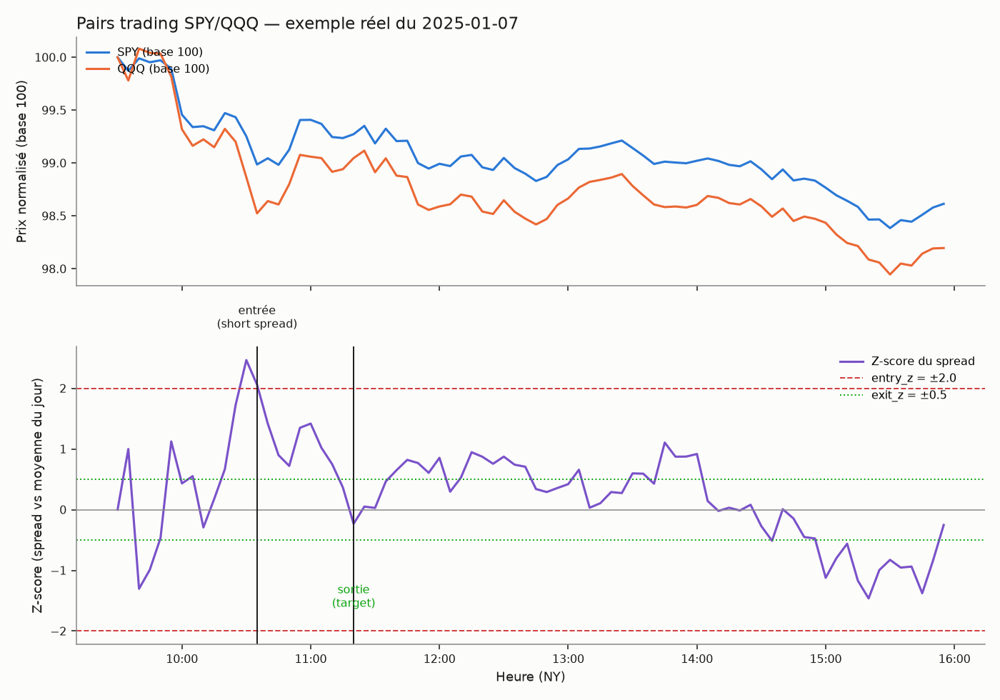

# Pairs trading SPY/QQQ — intraday

## L'idée

SPY (S&P 500) et QQQ (Nasdaq-100) sont deux ETF fortement corrélés. L'idée du
**pairs trading** (arbitrage statistique) est de trader l'écart entre les deux
plutôt que leur niveau : on construit un spread `log(SPY) - β·log(QQQ)` (β
estimé sur les clôtures des `beta_window` jours **précédents**, jamais recalculé
avec des données du jour même), puis on calcule un **z-score intraday** de ce
spread — moyenne et écart-type cumulés depuis l'ouverture, comme un VWAP. Quand
le spread s'écarte de plus de `entry_z` écarts-types de sa propre moyenne du
jour, on parie sur son retour (mean-reversion) :

- spread anormalement bas (z ≤ -`entry_z`) → **long SPY / short QQQ**
- spread anormalement haut (z ≥ +`entry_z`) → **short SPY / long QQQ**

Position dollar-neutre (100 actions SPY de référence, quantité QQQ ajustée au
ratio de prix — pas 1:1 en nombre d'actions). Sortie au retour à `exit_z`, ou
stop si l'écart continue de se creuser au-delà de `stop_z` (figé au moment du
signal). Un trade par jour maximum, comme le VWAP reversion.

## Exemple réel

SPY/QQQ, 7 janvier 2025 (barres 5 minutes, séance régulière 09:30-16:00 NY) :

Le panneau du haut montre les deux prix normalisés (base 100) : QQQ décroche
plus fort que SPY en fin de matinée, ce qui pousse le spread au-dessus de son
seuil d'entrée (z = +2.47) → signal **short spread** (short SPY / long QQQ). Le
spread revient ensuite vers sa moyenne, sortie sur `target` avec un gain de
+56$.

## Paramètres testés

- `beta_window` (20 / 40 jours) : fenêtre d'estimation du β, toujours sur des
  jours strictement antérieurs au jour tradé.
- `warmup_minutes` (30 / 60) : délai avant que le z-score du jour soit jugé
  assez stable pour chercher un signal.
- `entry_z` (1.5 / 2.0 / 2.5) : seuil d'écart déclenchant l'entrée.
- `exit_z` (0.25 / 0.5) : seuil de retour déclenchant la sortie normale.
- `stop_z` (3.0 / 4.0) : seuil au-delà duquel on coupe la perte.

96 configurations testées (2 × 2 × 3 × 2 × 2 × 2 pour `beta_window`).

## Rigueur du backtest (comme l'ORB, le VWAP reversion, le pullback, le gap trading, le squeeze et le breakout volume)

- **β jamais calculé sur le futur** : estimé par régression `log(SPY)~log(QQQ)`
  sur les clôtures de session des `beta_window` jours strictement précédents ;
  un jour sans historique suffisant (< `beta_window` jours) n'est simplement pas
  tradé.
- **Z-score causal** : moyenne/écart-type du spread cumulés depuis l'ouverture
  (barres 0..j uniquement, comme un VWAP) — aucune dépendance à une barre
  future. Un test dédié vérifie qu'un signal détecté à la barre k est identique
  si on tronque la journée juste après k (`test_no_lookahead_...`).
  Le stop est calculé comme une **magnitude** à partir de la direction du
  signal, avant application de la direction effective (qui peut être
  aléatoire dans le test placebo) — même précaution que sur le breakout
  volume/gap trading.
- **Exécution réaliste, plus conservatrice que les stratégies à 1 jambe** :
  faute de pouvoir combiner les hauts/bas des deux jambes en un seul niveau
  spread fiable, la détection stop/retour est évaluée sur les clôtures
  uniquement, et **toute** sortie (stop, retour ou fin de séance) est exécutée
  à l'ouverture de la barre suivante avec slippage sur les deux jambes (pas de
  fill "limite" idéalisé sans slippage comme pour l'ORB/VWAP à une jambe).
- Coûts et slippage inclus (commission par jambe et par côté, 100 actions SPY
  de référence, quantité QQQ ajustée au ratio de prix pour rester
  dollar-neutre).
- Alignement strict des deux séries : jointure sur les mêmes horodatages
  (`datetime`), jours écartés si la séance n'est pas complète sur **les deux**
  actifs.
- Split in-sample / hors-échantillon (70/30), puis walk-forward (12 mois train
  / 3 mois test).
- Test de robustesse contre un benchmark aléatoire (direction tirée à pile ou
  face, même timing de signal, même distance de stop en unités de spread).
- 9 tests unitaires (`test_pairs_backtest.py`) : spread constant → jamais de
  signal, écart construit à la main déclenche la bonne direction (long spread
  et short spread), absence de fuite de futur sur le z-score, stop qui se
  déclenche quand le spread continue de diverger après l'entrée, sortie forcée
  en fin de séance, bascule correcte de la direction dans le test placebo, β
  qui ne dépend que des jours antérieurs (inchangé si on modifie des jours
  futurs), colonnes de sortie du backtest correctes.

## Fichiers

- `pairs_backtest.py` — moteur de backtest (chargement + alignement SPY/QQQ,
  β glissant, spread, z-score, simulation, grille, walk-forward, test placebo,
  rapport).
- `test_pairs_backtest.py` — tests unitaires (9, tous passants).
- `make_example_chart.py` — génère le graphique d'exemple ci-dessus.
- `examples/spyqqq_pairs_example.png` — le graphique.
- `download_ib_stock.py` — script de téléchargement IB (repris tel quel de
  `vwap_reversion/`) ; les CSV `data_spy/`, `data_qqq/` sont copiés depuis
  `vwap_reversion/` (mêmes données, mêmes instruments, pour rester
  comparables).

## Résultats

Grille de 48 configurations, split IS/OOS 70/30, walk-forward (12 mois train /
3 mois test), test placebo — sur SPY/QQQ (2023-09 → 2026-09, 756 jours).

| Paire | Meilleure config (IS) | Sharpe IS | Sharpe OOS | Sharpe walk-forward | P-value placebo |
|---|---|---|---|---|---|
| SPY/QQQ | beta_window=40, warmup=60min, entry_z=2.5, exit_z=0.25, stop_z=4.0 | -0.08 | 0.17 | -0.86 (n=261) | 0.259 |

Points marquants :

- **Aucune des 48 configurations en grille n'a un Sharpe in-sample positif de
  façon significative** : la "meilleure" atteint à peine -0.08 (quasi nulle,
  t-stat -0.11), et la quasi-totalité du reste de la grille est franchement
  négative (jusqu'à -2.49). C'est différent des stratégies précédentes (ORB,
  breakout volume) où un edge apparent en IS s'effondrait ensuite en OOS :
  ici, il n'y a même pas d'edge apparent en IS pour commencer.
- Le Sharpe OOS de la meilleure config (0.17) est positif mais quasi nul et
  sans signification (t-stat 0.16, 53 trades) — c'est le bruit attendu autour
  de zéro, pas un signal qui se serait révélé hors-échantillon alors qu'il
  était masqué en IS.
- **Walk-forward négatif** (Sharpe -0.86, t-stat -1.21, 261 trades) : même en
  ré-optimisant tous les 3 mois sur les 12 mois précédents, la stratégie perd
  de l'argent sur la période 2024-2026.
- **Le test placebo ne rejette rien** (p=0.259) : la direction réelle du
  pari (long/short spread) ne fait pas mieux que la direction tirée au hasard
  sur la période hors-échantillon.
- Sensibilité au slippage (sur la config qui donne le meilleur résultat sur
  *toute* la période, donc optimiste) : Sharpe 0.55 à 0 tick, mais tombe déjà
  à 0.02 avec 1 tick de slippage réaliste par exécution et devient négatif
  (-0.50 à -1.02) à partir de 2 ticks — la stratégie ne survit pas à des coûts
  d'exécution réalistes sur les deux jambes.
- Décomposition : les trades short spread (415$ au total) et long spread
  (-378$ au total) se compensent globalement sur la période, sans edge net
  dans un sens ou dans l'autre ; performance annuelle instable (+95$ en 2023,
  -326$ en 2024, +219$ en 2025, +49$ en 2026) — pas de tendance stable.

**Verdict : stratégie abandonnée.** Contrairement à l'ORB ou au breakout
volume, ici il n'y a même pas d'edge apparent en in-sample sur les 48
configurations testées (meilleur Sharpe IS ≈ -0.08, presque toute la grille
négative) : la relation SPY/QQQ est trop stable et trop bien arbitrée par le
marché pour qu'un écart intraday de son propre z-score contienne une
information exploitable après coûts. Le walk-forward est négatif, et le test
placebo confirme l'absence de signal directionnel (p=0.259). La sensibilité au
slippage achève de démontrer que le résultat le plus favorable observé (à 0
coût) ne résiste pas à des coûts d'exécution réalistes sur une stratégie à
deux jambes.
