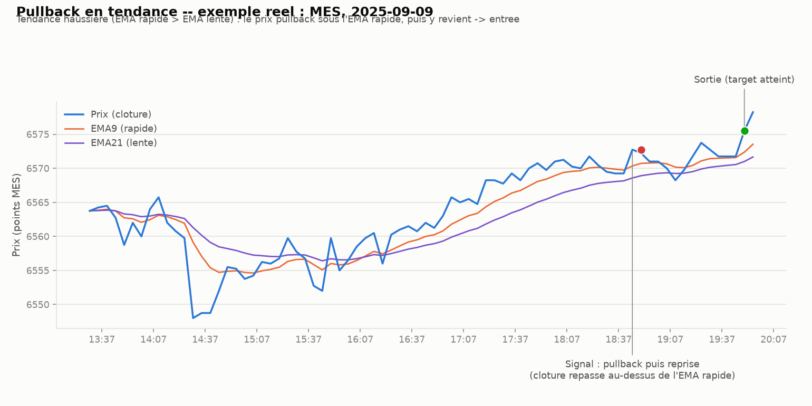

# Pullback en tendance (trend pullback) — intraday

## L'idée

Contrairement au **VWAP reversion** (parie sur un retournement) et à l'**ORB**
(parie sur la continuation de la première sortie de range), le pullback en
tendance essaie de capter une tendance intraday déjà établie, en entrant sur ses
creux temporaires ("pullbacks") :

- **Tendance haussière** (EMA rapide > EMA lente depuis au moins `min_trend_bars`
  barres consécutives) : si le prix repasse temporairement sous l'EMA rapide
  (pullback) puis y revient (clôture qui repasse au-dessus), on **achète** — on
  parie que la tendance de fond reprend après cette pause.
- **Tendance baissière** : symétrique, on **vend à découvert** sur un pullback qui
  échoue à percer l'EMA rapide vers le haut.

C'est un pari de **continuation** (comme l'ORB), mais basé sur un indicateur de
tendance mobile (EMA) plutôt que sur un range fixe de début de séance — ce qui
permet, en théorie, plusieurs opportunités par jour et une adaptation continue à
l'évolution du marché.

## Exemple réel

MES, 9 septembre 2025 (barres 5 minutes, séance régulière 09:30–16:00 NY) :

Le graphique montre l'EMA9 (rapide) et l'EMA21 (lente) qui restent ordonnées en
tendance haussière ; le prix repasse brièvement sous l'EMA9 (pullback), puis y
revient — c'est exactement le schéma que la stratégie cherche à capturer, avec une
sortie sur target atteint.

## Paramètres testés

- `ema_fast` / `ema_slow` : EMA rapide (9) et lente (21 ou 34) sur les clôtures 5
  min, recalculées depuis l'ouverture de chaque séance (pas de report d'un jour
  sur l'autre).
- `min_trend_bars` (2, 3, 5) : nombre de barres consécutives où EMA rapide/lente
  sont ordonnées dans le même sens avant de valider une tendance — filtre les
  croisements bruités.
- `atr_stop_mult` (0.5, 1.0, 1.5) : buffer de stop, en multiples d'ATR, au-delà du
  plus bas/haut atteint pendant le pullback.
- `atr_target_mult` (1.5, 2.0, 3.0) : distance du target, en multiples d'ATR,
  depuis l'entrée.
- `max_trades_per_day` (3) : plusieurs pullbacks peuvent être tradés dans la même
  séance, jamais de position simultanée.

## Rigueur du backtest (comme pour l'ORB et le VWAP reversion)

- Signal calculé sur les données déjà connues à la clôture d'une barre, exécution
  à l'ouverture de la barre suivante — pas de fuite de futur (look-ahead bias).
  EMA/ATR ne dépendent que des barres déjà connues ; la sortie "rupture de
  tendance" compare les EMA de la barre **précédente**, jamais celle en cours.
- Coûts et slippage inclus (mêmes hypothèses de commission/point_value que le
  VWAP reversion — 100 actions de référence pour SPY/QQQ, 1 contrat pour MES).
- Split in-sample / hors-échantillon (70/30), puis walk-forward (12 mois train /
  3 mois test).
- Test de robustesse contre un benchmark aléatoire (direction tirée à pile ou
  face, même timing, même distance de stop) pour vérifier que le signal contient
  une vraie information.
- 12 tests unitaires dédiés (`test_pullback.py`) : pas de fuite de futur sur
  EMA/ATR, pas de trade sans pullback réel, priorité stop > target sur une même
  barre, sortie forcée en fin de séance, plafond de trades/jour respecté.

## Fichiers

- `pullback_backtest.py` — moteur de backtest (indicateurs, simulation, grille,
  walk-forward, test placebo, rapport).
- `test_pullback.py` — tests unitaires (12, tous passants).
- `make_example_chart.py` — génère le graphique d'exemple ci-dessus.
- `examples/mes_pullback_example.png` — le graphique.
- `download_ib.py` / `download_ib_stock.py` — scripts de téléchargement IB
  (repris tels quels de `vwap_reversion/`) ; les CSV `data/`, `data_spy/`,
  `data_qqq/` sont copiés depuis `vwap_reversion/` (mêmes données, mêmes
  instruments, pour rester comparables).

## Résultats

Grille de 54 configurations, split in-sample (IS) / hors-échantillon (OOS) 70/30,
walk-forward (12 mois train / 3 mois test), test placebo (direction tirée à pile ou
face, même timing, même stop) — sur les 3 actifs déjà utilisés pour le VWAP
reversion.

| Actif | Meilleure config (IS) | Sharpe IS | Sharpe OOS | Sharpe walk-forward | P-value placebo |
|---|---|---|---|---|---|
| MES | ema_slow=21, min_trend=2, stop=1.0×ATR, target=2.0×ATR | **-1.76** | -2.17 | -9.67 (n=22) | 0.804 |
| SPY | ema_slow=34, min_trend=3, stop=1.5×ATR, target=1.5×ATR | +0.32 | -1.94 | -1.74 (n=1282) | 0.957 |
| QQQ | ema_slow=34, min_trend=2, stop=1.0×ATR, target=3.0×ATR | -0.12 | -2.28 | -0.93 (n=1228) | 0.850 |

Points marquants :

- **Sur MES, les 54 configurations de la grille sont toutes négatives en
  in-sample** (Sharpe IS de -1.76 à -3.20) — signal négatif avant même de
  regarder le hors-échantillon. Sur SPY et QQQ, la meilleure config IS est à
  peine positive (SPY, PF=1.03) ou quasi nulle (QQQ) : aucun signe d'edge solide
  même sur la période d'entraînement.
- **Aucun des trois actifs ne résiste à l'hors-échantillon** : Sharpe OOS entre
  -1.9 et -2.3 partout, walk-forward négatif partout.
- **Le test placebo est le signal le plus clair** : sur les trois actifs, le
  P&L réel est pire que le benchmark aléatoire dans 80 à 96 % des simulations
  (p-value 0.80 à 0.96). C'est l'inverse de ce qu'on veut voir (une vraie edge
  donnerait une p-value proche de 0, comme le VWAP reversion à p=0.003) : ici,
  la direction "pullback → reprise" est en moyenne **anti-corrélée** avec le
  mouvement futur, pas simplement bruitée.
- Sur MES, la stratégie reste négative même à slippage nul (Sharpe=-1.27) : la
  perte ne vient pas des coûts de transaction, elle vient du signal lui-même.
- Décomposition par raison de sortie (les trois actifs) : les trades qui
  sortent sur `trend_break` (rupture de tendance détectée) sont systématiquement
  perdants en moyenne — ce qui suggère que la "reprise" après pullback est
  souvent un faux signal plutôt qu'une vraie continuation.

**Verdict : stratégie abandonnée.** Le pullback en tendance, tel que défini ici
(EMA9/21 ou 34, reprise sur simple repassage de clôture), ne montre aucun edge
réel sur MES/SPY/QQQ : négatif en IS, négatif en OOS, négatif en walk-forward,
et le test placebo indique que le signal est même contre-productif plutôt que
simplement absent. Contrairement au VWAP reversion (signal réel mais
insuffisant), ici il n'y a pas de socle à améliorer avec un filtre — le
mécanisme de base (repassage de clôture au-dessus/en-dessous de l'EMA rapide
comme confirmation de reprise) semble mal calibré ou trop tardif : sur des
graphiques 5 minutes, ce signal est probablement déjà "vu" et arbitré par le
marché au moment où il se déclenche.
