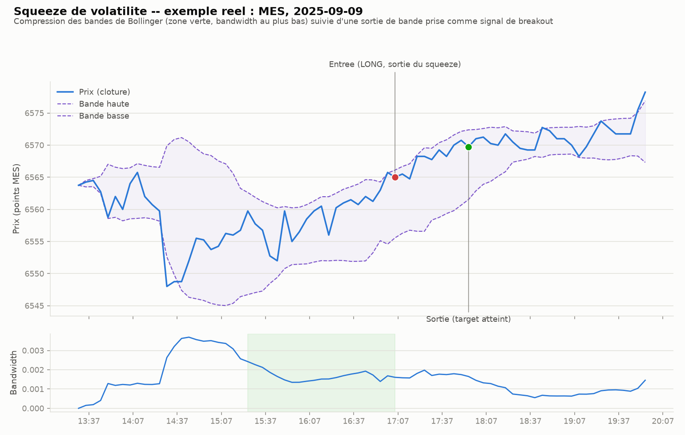

# Squeeze de volatilité (Bollinger) — intraday

## L'idée

Des bandes de Bollinger (moyenne mobile ± k×écart-type, sur une fenêtre
glissante) se resserrent quand la volatilité se comprime. On mesure ce
resserrement avec le **bandwidth** ((bande haute − bande basse) / moyenne) : un
squeeze est détecté quand le bandwidth actuel est au plus bas percentile de ses
valeurs récentes (`squeeze_lookback` barres passées).

L'idée testée : une phase de compression de volatilité précède souvent un
mouvement directionnel. On arme le signal dès qu'un squeeze est détecté, puis on
prend position dès que le prix casse une des deux bandes (breakout), dans le
sens de la cassure.

Plusieurs squeezes peuvent se produire dans la même séance → plusieurs trades
par jour possibles (comme le pullback), plafonnés à `max_trades_per_day`.

## Exemple réel

MES, 9 septembre 2025 (barres 5 minutes, séance régulière 09:30–16:00 NY) :

Le panneau du bas montre le bandwidth qui se comprime nettement (zone verte) ;
la sortie de bande qui suit est prise comme signal, avec une sortie sur target
atteint.

## Paramètres testés

- `bb_period` (14 / 20) : fenêtre des bandes de Bollinger.
- `bb_k` (1.5 / 2.0) : multiple d'écart-type des bandes.
- `squeeze_lookback` (20 / 40) : fenêtre passée sur laquelle on juge le
  bandwidth actuel « resserré ».
- `squeeze_pctl` (15 / 25) : percentile définissant le seuil de compression.
- `atr_stop_mult` (0.5 / 1.0) et `atr_target_mult` (1.5 / 2.5) : stop et target
  en multiples d'ATR intraday (cumulé depuis l'ouverture), figés au moment du
  signal.
- `max_trades_per_day` (3) : plusieurs squeezes possibles par jour, jamais de
  position simultanée.

## Rigueur du backtest (comme pour l'ORB, le VWAP reversion, le pullback et le gap trading)

- Bandes de Bollinger et bandwidth calculés à la clôture d'une barre, sur une
  fenêtre glissante qui ne dépend que des barres déjà connues ; le squeeze à la
  barre i ne dépend que des bandwidth passés (`i - squeeze_lookback` à `i - 1`),
  jamais du futur. Entrée à l'ouverture de la barre suivante, plus slippage.
  Stop/target calculés comme des magnitudes (mult × ATR) avant application de la
  direction — reste valide dans le test placebo à direction aléatoire.
- Coûts et slippage inclus (mêmes hypothèses que les stratégies précédentes —
  100 actions de référence pour SPY/QQQ, 1 contrat pour MES).
- Split in-sample / hors-échantillon (70/30), puis walk-forward (12 mois train /
  3 mois test).
- Test de robustesse contre un benchmark aléatoire (direction tirée à pile ou
  face, même timing, même distance de stop).
- 10 tests unitaires (`test_vol_squeeze.py`) : pas de fuite de futur sur les
  bandes/bandwidth/détection de squeeze, prix plat → bandwidth nul, squeeze puis
  breakout → trade dans le bon sens, pas de squeeze → pas de trade, priorité
  stop > target sur une même barre, sortie forcée en fin de séance, plafond de
  trades/jour respecté, bascule correcte de la direction dans le test placebo.

## Fichiers

- `vol_squeeze_backtest.py` — moteur de backtest (bandes de Bollinger, ATR,
  détection de squeeze, simulation, grille, walk-forward, test placebo,
  rapport).
- `test_vol_squeeze.py` — tests unitaires (10, tous passants).
- `make_example_chart.py` — génère le graphique d'exemple ci-dessus.
- `examples/mes_vol_squeeze_example.png` — le graphique.
- `download_ib.py` / `download_ib_stock.py` — scripts de téléchargement IB
  (repris tels quels de `vwap_reversion/`) ; les CSV `data/`, `data_spy/`,
  `data_qqq/` sont copiés depuis `vwap_reversion/` (mêmes données, mêmes
  instruments, pour rester comparables).

## Résultats

Grille de 64 configurations, split in-sample (IS) / hors-échantillon (OOS) 70/30,
walk-forward (12 mois train / 3 mois test), test placebo (direction tirée à pile
ou face, même timing, même stop) — sur MES, SPY et QQQ.

| Actif | Meilleure config (IS) | Sharpe IS | Sharpe OOS | Sharpe walk-forward | P-value placebo |
|---|---|---|---|---|---|
| MES | bb=20/2.0, lookback=20, pctl=15, stop=1.0×ATR, target=2.5×ATR | -1.11 | -0.87 | -8.66 (n=15) | 0.512 |
| SPY | bb=14/1.5, lookback=20, pctl=15, stop=0.5×ATR, target=2.5×ATR | 0.00 | **-2.59** | -1.02 (n=1136) | 0.877 |
| QQQ | bb=20/2.0, lookback=20, pctl=25, stop=0.5×ATR, target=2.5×ATR | -0.35 | -1.72 | -1.23 (n=1036) | 0.638 |

Points marquants :

- **Sur les 64 configurations de la grille, aucune n'est positive en in-sample
  sur SPY ou QQQ** (Sharpe IS de -0.35 à -2.85 selon la config) ; sur MES le
  meilleur Sharpe IS atteint tout juste -1.11. Le signal est négatif avant même
  de regarder le hors-échantillon, contrairement au gap trading où certaines
  configs IS étaient franchement positives.
- **La meilleure config IS (SPY) tombe à un Sharpe quasi nul en IS (0.00) mais
  s'effondre en OOS** (-2.59, n=631, total -4488$) — un signe classique d'IS
  choisi par pur bruit parmi 64 essais tous perdants, sans rapport avec l'OOS.
- **Aucun des trois actifs ne résiste au walk-forward** : Sharpe de -0.66 à
  -8.66 selon l'actif, avec des centaines de trades (SPY : n=1136, QQQ : n=1036)
  donc pas un problème d'échantillon trop petit.
- **Le test placebo ne rejette rien** : p=0.512 (MES), 0.877 (SPY), 0.638 (QQQ) —
  toutes proches de 0.5, ce qui signifie que le signe (achat/vente) choisi par le
  breakout de squeeze n'apporte pas plus d'information que le hasard. Contrairement
  au pullback en tendance (p=0.80-0.96, signal anti-corrélé), ici le signal
  n'est ni bon ni contre-productif : il est simplement absent.
- Décomposition par raison de sortie (les trois actifs) : les trades sortis sur
  `stop` sont majoritaires (2/3 à 3/4 des trades) et le win rate reste bas
  (15-31 %) malgré des targets généreux (jusqu'à 2.5×ATR) — le prix ne poursuit
  pas la direction de la sortie de bande assez souvent pour compenser des stops
  plus fréquents que les gains.
- Sensibilité au slippage : la performance se dégrade avec le slippage sur les
  trois actifs (ex. QQQ : Sharpe -0.40 à 0 tick vs -1.78 à 3 ticks), mais elle
  était déjà négative à 0 tick — les coûts de transaction aggravent un problème
  qui existe déjà dans le signal lui-même.

**Verdict : stratégie abandonnée.** Le squeeze de volatilité, sous cette forme
(compression du bandwidth Bollinger suivie d'une sortie de bande comme signal
directionnel), ne montre aucun edge sur MES/SPY/QQQ : négatif ou nul en IS sur
la quasi-totalité de la grille, négatif en OOS partout, négatif en walk-forward
partout, et le test placebo confirme qu'aucune information directionnelle
n'est présente (p proche de 0.5 partout). Contrairement au pullback (signal
contre-productif) ou au gap trading (signal réel mais insuffisant sur SPY), ici
le mécanisme semble simplement inopérant : une compression de volatilité suivie
d'une cassure de bande ne prédit pas la direction du mouvement qui suit, du
moins pas avec ce calcul de bandwidth/percentile sur des barres 5 minutes.
