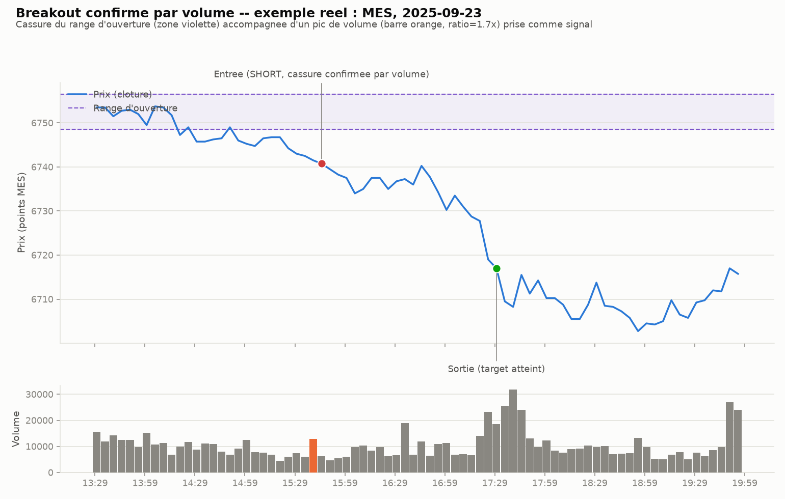

# Breakout confirmé par volume — intraday

## L'idée

Variante de l'**ORB** (Opening Range Breakout, cf. `breakout_opening/`) : le
range d'ouverture est calculé sur les `or_minutes` premières minutes de la
séance, puis on cherche la première clôture qui sort de ce range. La
différence ici est qu'une cassure n'est prise comme signal que si elle
s'accompagne d'un **volume anormalement élevé** — le ratio entre le volume de
la barre de cassure et le volume moyen des `volume_lookback` barres
précédentes doit dépasser `volume_ratio_min`. Une cassure à faible volume est
ignorée (on continue à chercher une cassure confirmée plus tard dans la
séance) : l'hypothèse est que ça filtre les fausses sorties (breakouts sans
conviction, qui se retournent vite).

## Exemple réel

MES, 23 septembre 2025 (barres 5 minutes, séance régulière 09:30–16:00 NY) :

Le panneau du bas montre le volume par barre ; la barre orange est celle qui
casse le range d'ouverture (zone violette) avec un pic de volume, prise comme
signal d'entrée dans le sens de la cassure.

## Paramètres testés

- `or_minutes` (15 / 30) : durée du range d'ouverture (comme l'ORB de base).
- `stop_mode` (`opposite` / `mid`) : stop à l'autre bord du range, ou au milieu.
- `target_r` (aucun / 1.5 / 2.0) : objectif en multiple du risque initial.
- `volume_lookback` (12 barres, soit 1h) : fenêtre du volume moyen de référence.
- `volume_ratio_min` (aucun filtre / 1.2 / 1.5 / 2.0) : seuil de ratio volume
  requis pour valider une cassure. `aucun filtre` = ORB de base (sert de point
  de comparaison direct).

## Rigueur du backtest (comme pour l'ORB, le VWAP reversion, le pullback, le gap trading et le squeeze)

- Range d'ouverture et ratio de volume calculés uniquement à partir de barres
  déjà connues : le ratio de la barre de cassure ne dépend jamais de son
  propre volume dans le dénominateur, seulement des barres strictement
  précédentes. Entrée à l'ouverture de la barre suivant la cassure confirmée,
  plus slippage. Stop/target calculés comme des magnitudes avant application
  de la direction — reste valide dans le test placebo à direction aléatoire.
- Coûts et slippage inclus (mêmes hypothèses que les stratégies précédentes —
  100 actions de référence pour SPY/QQQ, 1 contrat pour MES).
- Split in-sample / hors-échantillon (70/30), puis walk-forward (12 mois
  train / 3 mois test).
- Test de robustesse contre un benchmark aléatoire (direction tirée à pile ou
  face, même timing, même distance de stop).
- **Comparaison directe** : même config (OR/stop/target) avec et sans filtre
  volume, pour isoler l'effet du filtre plutôt que de comparer deux
  stratégies différentes.
- 10 tests unitaires (`test_volume_breakout.py`) : pas de fuite de futur sur
  le ratio de volume, cassure à faible volume filtrée (pas de trade), cassure
  à fort volume confirmée (identique au comportement ORB de base), absence de
  filtre = comportement ORB de base, filtre qui ignore une cassure non
  confirmée et attend une cassure confirmée plus tard, pas de cassure → pas de
  trade, priorité stop > target sur une même barre, sortie forcée en fin de
  séance, bascule correcte de la direction dans le test placebo, colonnes de
  sortie du backtest correctes.

## Fichiers

- `volume_breakout_backtest.py` — moteur de backtest (range d'ouverture,
  filtre de volume, simulation, grille, walk-forward, test placebo, rapport).
- `test_volume_breakout.py` — tests unitaires (10, tous passants).
- `make_example_chart.py` — génère le graphique d'exemple ci-dessus.
- `examples/mes_volume_breakout_example.png` — le graphique.
- `download_ib.py` / `download_ib_stock.py` — scripts de téléchargement IB
  (repris tels quels de `vwap_reversion/`) ; les CSV `data/`, `data_spy/`,
  `data_qqq/` sont copiés depuis `vwap_reversion/` (mêmes données, mêmes
  instruments, pour rester comparables).

## Résultats

Grille de 48 configurations (dont un tiers sans filtre volume, pour
comparaison directe), split IS/OOS 70/30, walk-forward (12 mois train / 3 mois
test), test placebo — sur MES, SPY et QQQ.

| Actif | Meilleure config (IS) | Filtre volume retenu | Sharpe IS | Sharpe OOS | Sharpe walk-forward | P-value placebo |
|---|---|---|---|---|---|---|
| MES | OR=30, stop=mid, sans target | **aucun** | 0.94 | -1.20 | -10.09 (n=7) | 0.718 |
| SPY | OR=15, stop=opposite, target=1.5×R | **aucun** | 1.30 | -0.65 | -0.16 (n=501) | 0.585 |
| QQQ | OR=15, stop=opposite, target=1.5×R | **aucun** | 1.63 | -0.84 | -1.18 (n=489) | 0.688 |

Points marquants :

- **Sur les trois actifs, la meilleure configuration in-sample n'utilise
  aucun filtre volume** (`volume_ratio_min=None`) — la ligne 2bis du rapport
  (même config, filtre retiré) est donc identique à la meilleure config
  trouvée : le filtre volume ne bat jamais l'ORB de base dans la grille, il ne
  fait qu'ajouter des configurations perdantes ou moins bonnes autour de lui.
  Sur SPY, la 2e et 3e meilleure config (Sharpe IS 1.01-1.30) sont aussi sans
  filtre ; les configs avec filtre (`vol_min` 1.2/1.5/2.0) plafonnent autour
  de 0.6-0.9 et sont souvent perdantes.
- **L'edge apparent en IS ne survit à aucun des trois actifs en OOS** : Sharpe
  IS de 0.94 à 1.63 (positif, parfois franchement, t-stat SPY/QQQ IS > 2)
  s'effondre à -0.65/-0.84/-1.20 en hors-échantillon — le même profil que
  l'ORB de base déjà documenté dans `breakout_opening/`, ce qui est cohérent
  puisque la meilleure config ici EST l'ORB de base.
- **Walk-forward négatif partout**, y compris avec des centaines de trades
  (SPY n=501, QQQ n=489) donc pas un problème d'échantillon : Sharpe -0.16
  (SPY) à -10.09 (MES, n=7 trop faible pour être concluant en soi, mais
  cohérent avec le reste).
- **Le test placebo ne rejette rien** : p=0.718 (MES), 0.585 (SPY), 0.688
  (QQQ) — la direction du breakout n'apporte pas plus d'information que le
  hasard sur la période hors-échantillon, filtre volume ou non.
- Sensibilité au slippage : sur SPY/QQQ la meilleure config reste positive
  même à 3 ticks de slippage (Sharpe 0.50-0.55) — la dégradation IS→OOS n'est
  donc pas un problème de coûts, c'est bien un edge in-sample qui ne se
  généralise pas (data snooping sur 48 configs).
- Décomposition : sur SPY/QQQ les trades sortis sur `target` sont rentables en
  moyenne (+274$ SPY, +371$ QQQ) mais les `stop` coûtent plus cher au total
  (-195$ à -272$ en moyenne) ; la performance 2023-2025 (positive) contraste
  avec 2026 (négative sur les trois actifs), signe supplémentaire que le
  résultat agrégé dépend fortement de la fenêtre choisie plutôt que d'un edge
  stable.

**Verdict : stratégie abandonnée.** Le filtre de confirmation par volume
n'apporte rien : la meilleure configuration en grille l'écarte systématiquement
sur les trois actifs, ce qui revient à confirmer (une nouvelle fois) que
l'ORB de base ne généralise pas hors-échantillon (Sharpe IS positif, parfois
significatif, mais négatif en OOS et en walk-forward sur MES/SPY/QQQ), et le
test placebo confirme qu'aucune information directionnelle n'est présente
(p entre 0.58 et 0.72). L'hypothèse de départ — qu'un volume anormalement
élevé sur la barre de cassure filtre les fausses sorties — n'est pas
vérifiée : ajouter ce filtre ne fait que réduire le nombre de trades sans
améliorer le ratio risque/rendement.
