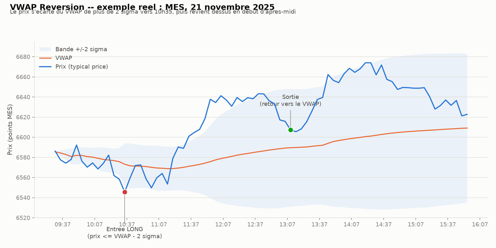

# VWAP Reversion — retour à la moyenne intraday

## L'idée

Le **VWAP** (prix moyen pondéré par le volume, recalculé depuis l'ouverture de la
séance) représente le "juste prix" moyen de la journée. Statistiquement, le prix
s'en écarte régulièrement (nouvelles, gros ordres, mouvements de flux), mais tend
à y revenir tant qu'il n'y a pas de vraie rupture de tendance.

La stratégie parie sur ce retour :
- **Écart trop grand vers le bas** (prix ≤ VWAP − *k* écarts-types) → on **achète**,
  en pariant sur un rebond vers le VWAP.
- **Écart trop grand vers le haut** (prix ≥ VWAP + *k* écarts-types) → on **vend**
  à découvert, en pariant sur un repli vers le VWAP.
- **Sortie** : quand le prix revient sur (ou proche) du VWAP, ou stop si l'écart
  continue de se creuser (le mouvement est peut-être une vraie tendance, pas un excès).

C'est l'exact opposé de l'ORB testé précédemment : l'ORB est une stratégie de
**breakout** (parie que la sortie de range continue), le VWAP reversion est une
stratégie de **retour à la moyenne** (parie que l'écart se referme). Les deux
peuvent difficilement bien marcher en même temps sur le même marché — ce qui en
fait un bon test complémentaire pour caractériser le régime actuel du MES.

## Exemple réel

MES, 21 novembre 2025 (barres 5 minutes, séance régulière 09:30–16:00 NY) :

Le prix s'écarte du VWAP de plus de 2 écarts-types vers 10h35 (excès baissier),
puis revient vers le VWAP en tout début d'après-midi — ce qui est exactement
le schéma que la stratégie cherche à capturer. Le graphique montre aussi que
tout n'est pas aussi propre : après le retour, le prix reprend une vraie tendance
haussière et s'écarte à nouveau, cette fois durablement (c'est le risque
principal du mean-reversion : confondre un excès temporaire avec le début d'une
tendance).

## Paramètres testés

- Nombre d'écarts-types de déclenchement (1.5σ, 2σ, 2.5σ).
- Fenêtre minimale avant de calculer un VWAP fiable (30 ou 60 min après l'ouverture).
- Sortie : retour partiel au VWAP (0.25σ ou 0.5σ), stop à 3σ ou 4σ.
- **Filtre de régime** (`regime_filter`) : n'autorise un trade que s'il va dans le
  sens de la tendance de fond. La tendance du jour est calculée à partir de la
  clôture de J-1 comparée à une moyenne mobile de 20 clôtures **strictement
  antérieures** (jamais celle du jour même, pour éviter toute fuite de futur) :
  +1 haussier, -1 baissier, 0 si l'historique est insuffisant. En mode haussier,
  les ventes à découvert contre-tendance sont bloquées ; en mode baissier, les
  achats contre-tendance sont bloqués.

## Résultats multi-actifs (avec et sans filtre de régime)

Backtestés avec la même rigueur que l'ORB (signal à la clôture d'une barre,
exécution à l'ouverture de la suivante, coûts + slippage inclus, split IS/OOS,
walk-forward 12 mois train / 3 mois test, grille de 48 configurations,
test placebo par direction aléatoire) sur MES (futures, ~1 an d'historique),
SPY et QQQ (ETF, ~3 ans d'historique, taille de référence 100 actions).

| Actif | Meilleur Sharpe IS (avec filtre) | Sharpe OOS | Walk-forward | Placebo (p-value) |
|---|---|---|---|---|
| MES | 0.87 | -1.66 | non concluant (2 trades seulement, historique trop court) | 0.003 |
| SPY | -0.29 (meilleur de toute la grille, filtre ou non) | -1.44 | -1.51 | 0.003 |
| QQQ | 0.97 | -1.95 | -0.83 | 0.003 |

**Constat** : sur les trois actifs, le test placebo est très significatif
(p=0.003) — la direction de retournement contient une vraie information, ce
n'est pas du bruit. Mais le filtre de régime, bien qu'il domine le haut du
classement in-sample et réduit l'asymétrie long/short (ex : le short de SPY
passe de -34$/trade en moyenne à un profil moins dégradé ; le long de QQQ
passe de -8.2$/trade à -3.3$/trade), ne rend la stratégie robuste sur aucun
actif : le Sharpe hors-échantillon et en walk-forward restent négatifs partout
sauf le cas MES non concluant. L'écart IS/OOS de QQQ (+0.97 → -1.95) est même
le symptôme classique d'un **overfitting** aggravé par le doublement de la
grille (48 configs au lieu de 24) — data snooping accru sans gain de
robustesse réelle.

**Verdict** : le filtre de régime améliore le diagnostic mais ne suffit pas à
faire passer le VWAP reversion la barre de robustesse (OOS/walk-forward
positifs) sur aucun actif à 3 ans d'historique fiable. La stratégie est
abandonnée en l'état.

## Rigueur du backtest (comme pour l'ORB)

- Signal calculé sur les données déjà connues à la clôture d'une barre, exécution
  à l'ouverture de la barre suivante — pas de fuite de futur (look-ahead bias).
- Coûts et slippage inclus.
- Split in-sample / hors-échantillon, puis walk-forward.
- Test de robustesse contre un benchmark aléatoire (direction tirée à pile ou face,
  même timing) pour vérifier que le signal contient une vraie information.

## Fichiers

- `make_example_chart.py` — génère le graphique d'exemple ci-dessus à partir de
  données réelles MES.
- `examples/mes_2025-11-21.json` — barres 5 min + VWAP + bandes ±2σ pour la
  journée d'exemple.
- `examples/mes_2025-11-21_reversion.png` — le graphique.
- (à venir) `vwap_backtest.py`, tests unitaires, données, résultats.
