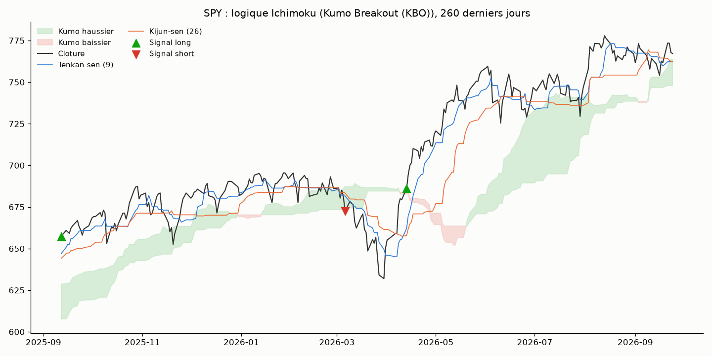

# Ichimoku Kinko Hyo — swing daily, cross-asset (20 instruments)

## L'idée

Toutes les stratégies précédentes du projet (`Intraday_trading/`) sont des
patterns intrajournaliers (ORB, pullback, VWAP, gap, squeeze, volume
breakout...) ou un biais structurel sans indicateur (`overnight_drift`).
Aucune n'utilisait encore un indicateur de suivi de tendance conçu pour des
timeframes plus élevés. L'Ichimoku Kinko Hyo est traditionnellement pensé
pour du daily/weekly (cf. WH SelfInvest) — d'où le choix de le tester en
barres **journalières** (swing, positions tenues plusieurs jours) plutôt
qu'en 5 minutes, et de sortir `Intraday_trading/` pour créer `Swing_trading/`.

Univers volontairement cross-asset (20 tickers, pas seulement des actions)
pour tester si un edge éventuel est spécifique à une classe d'actifs ou plus
général : indices (SPY, QQQ, IWM, DIA), secteurs SPDR (XLE, XLF, XLK, XLV,
XLY, XLP), matières premières (GLD, SLV, USO), obligataire (TLT, IEF),
international (EFA, EEM), méga-caps (AAPL, JPM, XOM, réutilisées de
`overnight_drift_stocks/`).

## Logique de l'indicateur

- **Tenkan-sen** = (plus haut + plus bas) / 2 sur 9 périodes (ligne rapide).
- **Kijun-sen** = (plus haut + plus bas) / 2 sur 26 périodes (ligne de base).
- **Senkou Span A** = (Tenkan + Kijun) / 2, décalé de 26 périodes en avant.
- **Senkou Span B** = (plus haut + plus bas) / 2 sur 52 périodes, décalé de 26
  périodes en avant.
- **Kumo (nuage)** = zone entre Senkou A et B.

Deux signaux testés (grille 2×2 avec long_short/long_only, comme les grilles
à 4 configs des stratégies précédentes) :
- **TKC** (Tenkan-Kijun Cross) : achat quand Tenkan croise au-dessus de
  Kijun, vente à découvert quand il croise en-dessous.
- **KBO** (Kumo Breakout) : achat quand la clôture casse au-dessus du nuage,
  vente à découvert quand elle casse en-dessous.

Position "reversal" : toujours investi (long ou short) dès le premier
signal ; en `long_only`, un signal court ramène simplement à plat.

## Logique illustrée sur données réelles (SPY, KBO)

Le nuage (vert = haussier, rouge = baissier), le Tenkan-sen, le Kijun-sen et
les marqueurs de signal (▲ achat, ▼ vente à découvert) sur les 260 derniers
jours de SPY.

## Rigueur du backtest

Voir `METHODOLOGIE.md` (racine) pour le détail de chaque test. Spécificités
de cette stratégie :

- **Look-ahead sur le nuage** : Senkou A/B sont calculés sur des fenêtres
  glissantes normales puis décalés de 26 périodes (`shift(26)`) — le nuage
  "visible" au jour t ne dépend que des données jusqu'à t-26. Vérifié par un
  test unitaire dédié (`test_senkou_lines_do_not_use_future_bars`) qui choque
  des barres futures et confirme que les valeurs passées du nuage ne
  changent pas.
- **Timing d'exécution** : signal calculé à la clôture du jour J, position
  cible appliquée à partir de l'**ouverture** de J+1 (jamais avant) — testé
  par `test_target_position_applied_next_day_not_same_day`.
- **P&L marqué au marché quotidien**, décomposé en segment overnight
  (clôture J-1 → ouverture J) et intraday (ouverture J → clôture J), ce qui
  permet d'appliquer slippage/commission uniquement au moment réel où la
  position change — jamais sur un segment sans exécution.
- **7 tests unitaires** (`test_ichimoku_backtest.py`), tous passants :
  absence de fuite de futur, timing d'exécution, `long_only` ne shorte
  jamais, cohérence comptable trades ↔ P&L quotidien (invariant critique
  après correction d'un bug d'attribution, voir plus bas), inversion de
  signe long/short, déterminisme du test placebo, position nulle pendant le
  warmup (78 barres = 52+26).
- Coûts : 1 tick de référence, sensibilité 0-3 ticks. Split IS/OOS 70/30
  chronologique. Walk-forward 12 mois train / 3 mois test. Test placebo
  (direction aléatoire, même timing, Monte Carlo, OOS).
- **Correction multiple-testing** : 20 instruments testés en parallèle →
  seuil de p-value Bonferroni-corrigé = 0.05 / 20 = **0.0025** (voir Verdict).

## Données

`download_ib_daily.py` — téléchargement IB en barres journalières (plus
simple que les téléchargeurs 5 min : IB renvoie plusieurs années en une
seule requête avec `durationStr="10 Y"`, pas de fenêtrage nécessaire).
10 ans de données (2016-09 → 2026-09, ~2500 barres/ticker, sauf IEF ~2300
barres, historique plus court) pour les 20 tickers dans `data_<ticker>/`.

## Résultats (meilleure config choisie en in-sample, par instrument)

| Instrument | Classe | Config gagnante | Sharpe IS | Sharpe OOS | Sharpe walk-forward | p-value placebo (OOS) |
|---|---|---|---|---|---|---|
| SPY | Indice | TKC long_only | 0.38 | 1.69 | 0.56 | **0.030** |
| QQQ | Indice | TKC long_only | 0.60 | 1.27 | 0.75 | 0.080 |
| IWM | Indice | KBO long_only | -0.03 | 0.54 | -0.11 | 0.083 |
| DIA | Indice | KBO long_only | 0.05 | 0.85 | -0.03 | 0.103 |
| XLE | Énergie | TKC long_short | 0.35 | -0.92 | -0.09 | 0.950 |
| XLF | Finance | KBO long_only | 0.10 | 0.58 | -0.18 | 0.143 |
| XLK | Tech | TKC long_only | 0.47 | 1.06 | 0.57 | 0.063 |
| XLV | Santé | TKC long_only | 0.22 | 0.56 | 0.01 | 0.189 |
| XLY | Consommation disc. | TKC long_only | 0.40 | 0.10 | -0.21 | 0.389 |
| XLP | Consommation courante | TKC long_only | 0.29 | -0.38 | -0.05 | 0.817 |
| GLD | Or | TKC long_only | 0.31 | 0.72 | 0.54 | 0.136 |
| SLV | Argent | TKC long_only | -0.00 | 0.18 | 0.21 | 0.349 |
| USO | Pétrole | TKC long_short | 0.39 | 0.07 | 0.05 | 0.462 |
| TLT | Oblig. long terme | KBO long_short | 0.12 | -0.22 | -0.15 | 0.764 |
| IEF | Oblig. moyen terme | KBO long_short | 0.74 | 0.14 | 0.33 | 0.332 |
| EFA | International dév. | KBO long_only | -0.03 | 0.25 | -0.51 | 0.302 |
| EEM | Émergents | KBO long_short | 0.35 | -0.50 | 0.05 | 0.900 |
| AAPL | Méga-cap tech | TKC long_only | 0.79 | 0.44 | 0.55 | 0.203 |
| JPM | Méga-cap finance | KBO long_only | 0.13 | 0.65 | 0.21 | 0.173 |
| XOM | Méga-cap énergie | TKC long_only | 0.28 | 0.12 | 0.11 | 0.385 |

Détail complet (grille des 4 configs, IS/OOS, walk-forward fenêtre par
fenêtre, sensibilité slippage) dans `backtest_<ticker>.log` pour chaque
instrument. Trades détaillés dans `trades_<TICKER>_best.csv`. Courbes
d'équité dans `examples/equity_<TICKER>.png`.

## Constats

- **SPY est le seul instrument sur 20 dont la p-value placebo (0.030) passe
  le seuil naïf de 0.05** — et c'est la première fois dans tout le projet
  qu'une stratégie **basée sur un signal directionnel** (pas un biais
  structurel comme `overnight_drift`) y parvient. Le Sharpe reste positif en
  IS (0.38), OOS (1.69, t=2.92) et walk-forward (0.56), et le résultat est
  quasiment insensible au slippage (Sharpe 0.87 stable de 0 à 3 ticks sur la
  période complète) — contrairement à `overnight_drift_stocks/` où
  XOM/WMT s'effondraient sous 1-2 ticks.
- **Mais aucun instrument ne passe la correction Bonferroni** : avec 20
  instruments testés en parallèle, le seuil de significativité corrigé est
  0.05/20 = 0.0025, très loin des 0.030 de SPY. Sur 20 essais indépendants,
  obtenir au moins un p<0.05 par pur hasard a une probabilité de
  1-(0.95)^20 ≈ 64 % — un seul "succès" isolé à p=0.030 est exactement le
  type de résultat que le protocole de la section 5 de `METHODOLOGIE.md` est
  conçu pour ne pas prendre pour argent comptant.
- **Pas de config unanime** : TKC long_only domine sur les indices/secteurs
  actions (SPY, QQQ, XLK, XLV, XLY, XLP, GLD, SLV, AAPL, XOM), mais KBO
  (souvent long_short) l'emporte sur IWM, DIA, XLF, TLT, IEF, EFA, EEM, JPM —
  aucun signal clairement supérieur à l'autre sur l'ensemble du panier.
- **Le Sharpe OOS/walk-forward est incohérent (change de signe ou s'effondre
  par rapport à l'IS) sur la majorité des instruments** : XLE (0.35 → -0.92
  OOS, signe classique d'overfitting), XLP (0.29 → -0.38), EEM (0.35 → -0.50),
  TLT (0.12 → -0.22), XLY et USO quasi nuls en walk-forward malgré un IS
  positif. Seuls SPY, QQQ, XLK, GLD, AAPL, JPM gardent un signe cohérent et
  un ordre de grandeur comparable entre IS/OOS/walk-forward — et parmi
  ceux-là, seul SPY passe le test placebo même au seuil non corrigé.
- **Aucune spécialisation par classe d'actifs** : les meilleures p-values ne
  se concentrent ni sur les indices, ni sur les matières premières, ni sur
  l'obligataire — le signal Ichimoku ne semble pas capter un edge structurel
  propre à une classe, plutôt du bruit qui ressort ponctuellement.

## Verdict

**Rejeté sur les 20 instruments après correction multiple-testing.** Le
critère de décision global de `METHODOLOGIE.md` exige que la p-value du
test placebo survive à la correction Bonferroni quand plusieurs instruments
sont testés en parallèle (condition 5) — aucun des 20 ne descend sous
0.0025 (minimum observé : SPY à 0.030, soit 12× trop haut). Le résultat SPY
pris isolément aurait pu sembler prometteur (c'est d'ailleurs le premier
signal directionnel du projet à passer le seuil naïf de 0.05), mais
l'exigence de robustesse face au nombre d'essais — la même exigence qui a
fait rejeter `intraday_seasonality/` malgré des tranches horaires
individuellement significatives — s'applique ici à l'identique. Le nombre de
faux positifs attendus sur 20 essais indépendants à p=0.05 est déjà proche
de 1, ce qui rend un unique résultat à p=0.030 statistiquement inconcluant.

## Fichiers

- `ichimoku_backtest.py` — moteur (lignes Ichimoku, position cible, P&L
  marqué au marché, grid search, walk-forward, test placebo, slippage).
- `test_ichimoku_backtest.py` — 7 tests unitaires.
- `download_ib_daily.py` — téléchargement IB (barres journalières, 10 ans).
- `make_example_chart.py` — graphique pédagogique (nuage, Tenkan, Kijun,
  signaux) sur données réelles.
- `data_<ticker>/` — CSV journaliers, 20 instruments.
- `backtest_<ticker>.log` — sortie complète du protocole pour chaque titre.
- `trades_<TICKER>_best.csv` — trades détaillés de la meilleure config IS.
- `examples/equity_<TICKER>.png` — courbes d'équité (20).
- `examples/ichimoku_logic_SPY.png` — graphique pédagogique.
