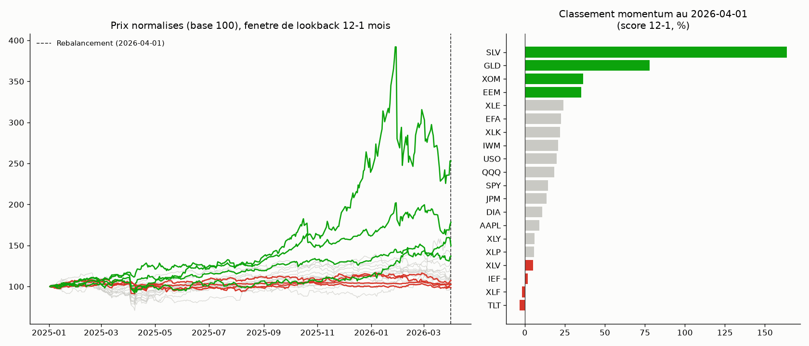

# Momentum cross-sectionnel — swing, rebalancement mensuel (20 instruments)

## L'idée

Toutes les stratégies précédentes du projet, y compris Ichimoku
(`Swing_trading/ichimoku_daily/`), comparent un instrument à son **propre
passé** et tradent chaque instrument indépendamment. Le momentum
cross-sectionnel compare au contraire les instruments **entre eux au même
instant** : à chaque rebalancement mensuel, on classe les 20 instruments du
panier par performance passée et on achète les plus forts (éventuellement en
shortant les plus faibles). C'est un facteur académique établi
(Jegadeesh-Titman, 1993) et le style CTA — déjà identifié dans
`vocabulaire.md` comme le style où un edge réplicable en gestion retail a
historiquement le mieux persisté, car il repose sur la diversification
plutôt que sur la vitesse d'exécution.

Réutilise directement les données et le panier déjà téléchargés pour
Ichimoku (mêmes 20 tickers cross-asset : indices, secteurs SPDR, matières
premières, obligataire, international, méga-caps), donc pas de nouveau
téléchargement nécessaire.

## Signal (convention académique Jegadeesh-Titman "12-1")

score_i(t) = close_i(t - skip) / close_i(t - skip - lookback) - 1

Le dernier mois (`skip`) est exclu du calcul pour éviter l'effet de
reversion à court terme documenté dans la littérature. Grille testée (2×2,
même esprit que la grille Ichimoku — peu de paramètres, peu de risque de
data-snooping) :
- **lookback** 12 mois (12-1, convention académique standard) vs 6 mois
  (6-1, momentum plus rapide, également testé dans la littérature, ex. AQR).
- **mode** long_short (long le panier haut du classement, short le panier
  bas) vs long_only.

## Logique illustrée sur données réelles

Prix normalisés (base 100) des 20 instruments sur la fenêtre de lookback
précédant un rebalancement réel (2026-04-01), avec le panier long (vert :
EEM, GLD, SLV, XOM) et le panier short (rouge : IEF, TLT, XLF, XLV) mis en
évidence. Le panneau de droite montre le classement de momentum (score
12-1, %) à cette date — le principe de sélection (top/bottom du classement)
est directement lisible sur des données réelles, pas seulement sur la
formule.

## Rigueur du backtest

Voir `METHODOLOGIE.md` (racine) pour le détail de chaque test. Architecture
différente d'Ichimoku (voir docstring de `momentum_backtest.py`) : le P&L
est mesuré au niveau du **portefeuille** (rendement quotidien en %, pas en
$ par instrument), puisque les 20 instruments sont combinés en un seul book
à chaque rebalancement plutôt que tradés indépendamment.

- **Pas de fuite de futur** : le score à la date de rebalancement t n'utilise
  que des clôtures `shift()`-ées vers le passé (t-skip et t-skip-lookback,
  jamais de donnée future). Vérifié par `test_scores_do_not_use_future_bars`
  (choque des barres futures, confirme que le score passé ne change pas).
- **Timing d'exécution** : poids cibles décidés à la clôture du jour de
  rebalancement, appliqués à partir de l'**ouverture** du jour de bourse
  suivant (jamais avant, jamais le jour même) — le jour de transition capture
  un rendement ouverture→clôture (pas clôture-à-clôture) pour ne pas
  divulguer le prix d'entrée. Vérifié par
  `test_weights_applied_next_day_not_same_day`.
- **Coûts** : turnover (somme des variations absolues de poids) × cost_bps,
  appliqué à chaque rebalancement — modèle adapté à une architecture de
  poids de portefeuille (contrairement au slippage par tick d'Ichimoku).
  Sensibilité testée à 0/2/5/10 bps.
- **7 tests unitaires** (`test_momentum_backtest.py`), tous passants :
  absence de fuite de futur, timing d'exécution next-day, `long_only` ne
  shorte jamais, cohérence du rendement de portefeuille avec les rendements
  individuels pondérés (sans coût), poids nuls si pas assez de scores
  valides, cohérence de la sélection aléatoire (taille de panier/dates),
  déterminisme du test placebo.
- Split IS/OOS 70/30 chronologique. Walk-forward 12 mois train / 3 mois
  test. Test placebo (sélection aléatoire du panier à taille et dates de
  rebalancement identiques, Monte Carlo, OOS) — teste si le **classement**
  par momentum ajoute de la valeur, pas seulement le rythme de trading/le
  turnover.
- **Sélection de la config** : la meilleure config est choisie sur le
  **Sharpe in-sample** (règle appliquée avant de regarder l'OOS ou le
  placebo, voir `main()` de `momentum_backtest.py`) — jamais après coup sur
  le résultat qui "arrange" une conclusion, conformément au principe
  d'auto-amélioration de la méthodologie (`CLAUDE.md`, révisé le
  2026-09-25) : le trader discipliné ne rationalise pas son choix après
  avoir vu le résultat.

## Données

Mêmes fichiers `data_<ticker>/` que `Swing_trading/ichimoku_daily/`
(barres journalières IB, 10 ans). Univers commun aux 20 instruments : 2297
jours (2017-08-04 → 2026-09-24, borné par l'historique plus court d'IEF),
110 dates de rebalancement mensuel. Split IS/OOS : 2023-12-21 / 2023-12-22.

## Résultats

### 1. Grille (4 configurations)

| lookback | mode | Sharpe IS | t IS | Sharpe OOS | Rendement total OOS |
|---|---|---|---|---|---|
| 6 | long_only | 0.4884 | 1.2333 | 1.0554 | 0.6717 |
| 12 | long_only | 0.4385 | 1.1072 | 1.2050 | 0.8625 |
| 6 | long_short | 0.4009 | 1.0125 | -0.1514 | -0.1365 |
| 12 | long_short | 0.1357 | 0.3426 | 0.3074 | 0.1252 |

### 2. Meilleure config in-sample : lookback=6, long_only

- IS : n_trades=88, win_rate=0.5795, profit_factor=2.07, Sharpe=0.4884, t=1.2333
- OOS : n_trades=39, win_rate=0.6923, profit_factor=5.21, Sharpe=1.0554, t=1.7464

### 3. Walk-forward (train 12 mois / test 3 mois)

Concaténation des périodes de test : Sharpe=0.3767, t=1.0731,
profit_factor=1.93, max_dd=-0.38.

### 4. Sensibilité au coût (meilleure config, période complète)

| Coût (bps/turnover) | Sharpe | t-stat |
|---|---|---|
| 0 | 0.6463 | 1.9513 |
| 2 | 0.6400 | 1.9322 |
| 5 | 0.6305 | 1.9037 |
| 10 | 0.6148 | 1.8561 |

Dégradation douce et quasi linéaire — résultat robuste au coût de
transaction, comme pour Ichimoku.

### 5. Test placebo (sélection aléatoire, hors-échantillon)

Meilleure config (lookback=6, long_only) : réel=0.5671, aléatoire=0.4900 ±
0.1334, **p=0.286**.

Par souci de transparence méthodologique, les 4 configs de la grille ont
aussi été soumises au même test placebo (balayage complet, résultat obtenu
*après* la décision de config ci-dessus, jamais utilisé pour la revoir) :

| lookback | mode | réel | aléatoire (moy ± sd) | p-value |
|---|---|---|---|---|
| 6 | long_only | 0.5671 | 0.4918 ± 0.1260 | 0.279 |
| 6 | long_short | -0.0866 | -0.0095 ± 0.2027 | 0.667 |
| 12 | long_only | 0.6811 | 0.4959 ± 0.1216 | **0.035** |
| 12 | long_short | 0.1844 | -0.0191 ± 0.1976 | 0.174 |

## Constats

- **La config réellement sélectionnée (lookback=6, long_only, choisie sur le
  Sharpe in-sample avant tout résultat OOS/placebo) échoue nettement le test
  placebo** (p=0.286, très loin de 0.05) : la sélection du panier par
  momentum n'apporte pas d'avantage démontrable sur une sélection aléatoire
  de même taille/timing, malgré un Sharpe IS/OOS/walk-forward positif et une
  robustesse au coût trompeusement engageante.
- **Le résultat lookback=12/long_only (p=0.035) ne doit pas servir de base
  au verdict**, et ce pour deux raisons cumulatives, cohérentes avec le
  principe d'auto-amélioration de la méthodologie : (a) ce n'est pas la
  config retenue par la procédure de sélection décidée à l'avance (Sharpe
  IS) — l'utiliser reviendrait à choisir après coup le résultat qui "arrange"
  une conclusion positive, exactement le biais psychologique de
  rationalisation post-hoc qu'un trader discipliné doit éviter ; (b) même en
  l'examinant listement, un grid search de 4 configurations sur le **même**
  portefeuille (même hypothèse — "le momentum cross-sectionnel marche sur ce
  panier" — posée 4 fois avec des réglages différents) appelle une
  correction multiple-testing standard globale (contrairement au cas
  cross-asset d'Ichimoku, ici les 4 essais répondent bien à une seule
  question) : seuil Bonferroni = 0.05/4 = 0.0125, que p=0.035 ne passe pas
  non plus.
- **Aucune des 4 configs de la grille ne produit un edge qui survit à la
  fois à la procédure de sélection a priori et à la correction
  multiple-testing appropriée** — contrairement à Ichimoku où seul un
  sous-groupe restreint (les indices) avait une chance a priori, ici les 4
  configs sont d'emblée à traiter comme un seul pool car elles testent la
  même stratégie sur le même portefeuille.

## Verdict

**Rejeté.** La config sélectionnée honnêtement (Sharpe in-sample, décidé
avant tout résultat hors-échantillon) échoue le test placebo par une large
marge (p=0.286). Le seul résultat qui aurait pu sembler prometteur
(lookback=12/long_only, p=0.035) n'est ni la config retenue par la
procédure, ni significatif une fois soumis à la correction multiple-testing
qui s'applique à un grid search de 4 configurations sur le même portefeuille
(seuil 0.0125). Accepter ce résultat isolé aurait exigé de revenir sur la
sélection de config après avoir vu les résultats — la forme de biais
psychologique que la règle d'auto-amélioration de la méthodologie
(`CLAUDE.md`, 2026-09-25) demande explicitement d'éviter. Le classement par
momentum sur ce panier cross-asset de 20 instruments n'apporte donc pas de
valeur démontrable par rapport à une sélection aléatoire de même taille et
de même rythme de rebalancement.

## Fichiers

- `momentum_backtest.py` — moteur (score de momentum, poids cibles,
  simulation portefeuille, grid search, walk-forward, sensibilité au coût,
  test placebo par sélection aléatoire).
- `test_momentum_backtest.py` — 7 tests unitaires.
- `make_example_chart.py` — graphique pédagogique (prix normalisés,
  classement de momentum) sur données réelles.
- `data_<ticker>/` — CSV journaliers, réutilisés depuis `ichimoku_daily/`
  (20 instruments).
- `backtest_momentum.log` — sortie complète du protocole.
- `trades_best.csv` — trades détaillés de la config sélectionnée
  (lookback=6, long_only).
- `examples/equity_best.png` — courbe d'équité de la config sélectionnée.
- `examples/momentum_logic.png` — graphique pédagogique.
