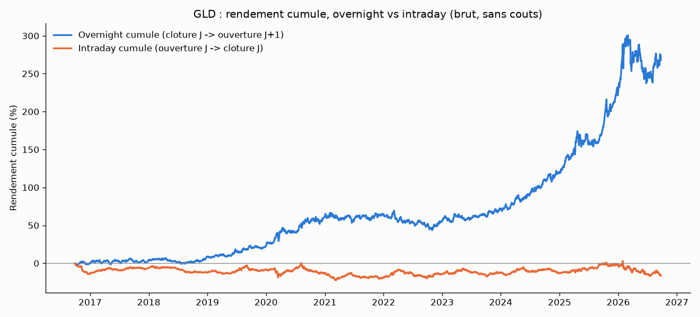

# Overnight drift sur ETF-paniers hors indices actions larges

## L'idée

`overnight_drift` (#10) est le seul edge du projet à avoir survécu au
protocole complet — mais uniquement sur des indices/ETF actions **larges**
(SPY, QQQ, IWM, DIA). `overnight_drift_stocks` (#11) l'a rejeté sur des
actions individuelles. La frontière tracée par #11 opposait implicitement
"indice/ETF large" à "action individuelle", en mélangeant deux dimensions
distinctes : la **classe d'actif** (actions vs autre) et la **structure de
produit** (panier diversifié vs titre unique). Auto-critique (Rule #4,
documentée dans `STRATEGIES.md` #14→#15) : si l'edge overnight tient à la
structure de *panier* (flux de rebalancement, création/rachat de parts,
primes de risque liées à la fermeture des marchés) plutôt qu'à un phénomène
spécifique aux indices actions, il devrait aussi apparaître sur des
ETF-paniers d'autres classes d'actifs. C'est l'hypothèse testée ici — une
**généralisation**, pas une répétition (Rule #3).

Univers : 13 ETF-paniers hors indices actions larges, en 4 sous-classes
économiques a priori — secteurs SPDR (XLE, XLF, XLK, XLV, XLY, XLP), matières
premières (GLD, SLV, USO), obligataire (TLT, IEF), international (EFA, EEM).

## Logique du mécanisme

Reprend le mécanisme le plus simple de `overnight_drift`, **sans filtre ni
indicateur** (contrairement à #14, filtre de régime Kumo) : position prise à
la clôture du jour J, revendue à l'ouverture du jour J+1, tous les jours.
Seul paramètre de grille : la **direction** (long/short), choisie en
in-sample sur le Sharpe le plus élevé, jamais présupposée — cela permet de
détecter un edge overnight de signe opposé (short) sans biais de
confirmation (Rule #2).

## Logique illustrée sur données réelles (GLD)

Décomposition du rendement cumulé (brut, sans coûts) entre la fenêtre
overnight (clôture J → ouverture J+1, bleu) et la fenêtre intraday (ouverture
J → clôture J, orange), sur les 10 ans de données GLD : +268 % cumulés côté
overnight contre -16 % côté intraday — la même asymétrie structurelle déjà
documentée sur les indices actions, ici sur un ETF or physique.

## Rigueur du backtest

Voir `METHODOLOGIE.md` (racine) pour le détail de chaque test. Spécificités
de cette stratégie :

- **Sélection de la direction en in-sample, sur un critère fixé avant de
  regarder l'OOS** (Rule #2) : pour chaque instrument, la direction
  (long/short) est choisie par le Sharpe in-sample le plus élevé, jamais par
  le résultat OOS ou placebo.
- **Aucune fuite de futur** : chaque trade ne dépend que de `close[i]` et
  `open[i+1]`, jamais d'un extremum intrajournalier ni d'une barre future —
  vérifié par `test_no_lookahead_shocking_future_bars_does_not_change_past_trades`
  et `test_entry_and_exit_never_reference_intraday_extremes`.
- **9 tests unitaires** (`test_basket_backtest.py`), tous passants : jambe
  overnight correctement calculée, absence de fuite de futur, symétrie
  long/short, effet du slippage, un trade par paire de jours, déterminisme et
  préservation du timing du test placebo.
- Split IS/OOS 70/30 chronologique, walk-forward 12 mois train / 3 mois
  test, test placebo (direction aléatoire, même timing, Monte Carlo, OOS),
  sensibilité au slippage 0-3 ticks.
- **Correction Bonferroni hiérarchique par sous-groupe** : les 13 ETF-paniers
  forment le sous-groupe pré-enregistré pour cette hypothèse (structure de
  panier hors indices actions larges) — seuil = 0.05/13 ≈ **0.00385**. Ce
  pooling est explicitement hétérogène sur le plan économique (secteurs vs
  matières premières vs obligataire vs international), justifié uniquement
  par l'hypothèse commune de structure de produit testée ici — voir
  `STRATEGIES.md` #14→#15 pour l'auto-critique complète et le caveat
  pré-enregistré (second test hiérarchique plus étroit requis si l'edge se
  concentre dans une seule des 4 sous-classes).
- **Suivi explicite de la puissance statistique** : n_trades ≈ 1600-1760 en
  IS et ≈ 690-754 en OOS pour chaque instrument — tailles d'échantillon
  larges, la puissance statistique n'est pas le facteur limitant.

## Données

Réutilise les CSV journaliers déjà téléchargés pour `ichimoku_daily/` /
`overnight_drift_regime_filtered/` (`download_ib_daily.py`, IB, 10 ans,
2016-09 → 2026-09, 2017-08 → 2026-09 pour IEF) pour les 13 mêmes tickers,
dans `data_<ticker>/`.

## Résultats

| Instrument | Sous-classe | Direction IS | Sharpe IS | n_IS | Sharpe OOS | n_OOS | Sharpe walk-forward | p-value placebo (OOS) |
|---|---|---|---|---|---|---|---|---|
| GLD | Matières premières | long | **0.04** | 1756 | 1.15 | 754 | 0.57 | 0.013 |
| USO | Matières premières | long | -0.01 | 1756 | 0.21 | 754 | -0.50 | 0.233 |
| TLT | Obligataire | short | -0.22 | 1756 | -0.25 | 754 | 0.02 | 0.073 |
| XLY | Secteurs | long | -0.33 | 1756 | -0.15 | 754 | -0.56 | 0.146 |
| XLV | Secteurs | long | -0.63 | 1756 | -0.91 | 754 | -0.74 | 0.508 |
| XLK | Secteurs | long | -0.88 | 1756 | 1.02 | 754 | 0.07 | 0.003 |
| EFA | International | short | -0.86 | 1756 | -1.42 | 754 | -1.27 | 0.771 |
| XLE | Secteurs | long | -1.11 | 1756 | -0.67 | 754 | -1.46 | 0.106 |
| EEM | International | short | -1.38 | 1756 | -1.62 | 754 | -1.14 | 0.804 |
| IEF | Obligataire | short | -1.54 | 1606 | -1.89 | 689 | -1.40 | 0.266 |
| XLF | Secteurs | long | -1.71 | 1756 | -1.42 | 754 | -1.49 | 0.066 |
| XLP | Secteurs | long | -1.81 | 1756 | -2.10 | 754 | -2.13 | 0.654 |
| SLV | Matières premières | long | -1.94 | 1756 | 0.23 | 754 | -0.33 | 0.093 |

Détail complet (grille des 2 directions, walk-forward fenêtre par fenêtre,
sensibilité slippage) dans `backtest_all.log`. Trades détaillés dans
`trades_<TICKER>_best.csv`. Courbes d'équité dans `examples/equity_<TICKER>.png`.

## Constats

- **Sur 12 des 13 instruments, la meilleure direction en in-sample a un
  Sharpe négatif** — le critère 1 du protocole (Sharpe IS positif, nécessaire
  mais très insuffisant, voir `METHODOLOGIE.md`) échoue avant même de
  regarder l'OOS. L'edge overnight structurel des indices actions larges ne
  se généralise pas mécaniquement aux ETF-paniers d'autres classes d'actifs.
- **Seul GLD passe le critère 1** (Sharpe IS = 0.04, positif mais très
  faible), avec un signe cohérent en OOS (1.15) et en walk-forward (0.57).
  Mais son p-value placebo (0.013) **échoue le seuil Bonferroni
  pré-enregistré du sous-groupe (0.00385)** — l'écart au hasard n'est pas
  assez net pour être distingué d'un faux positif sur 13 essais.
- **XLK et SLV montrent un OOS/walk-forward positif (voire p=0.003 pour
  XLK) alors que leur config sélectionnée en in-sample est en Sharpe
  négatif** — c'est exactement le symptôme inverse du data snooping classique
  (un résultat OOS qui n'a pas été *sélectionné* par le critère IS ne peut
  pas être invoqué comme validation ; le retenir reviendrait à choisir la
  config après avoir vu l'OOS, violation directe de Rule #2). Ces deux cas ne
  soutiennent donc pas l'hypothèse testée, malgré l'apparence favorable en
  seconde lecture.
- **Aucune des 4 sous-classes économiques ne montre un edge concentré et
  cohérent** (secteurs : tous négatifs en IS ; matières premières : 1/3 tout
  juste positif ; obligataire : les deux négatifs ; international : les deux
  négatifs) — le caveat pré-enregistré (second test hiérarchique plus étroit
  si l'edge se concentre dans une sous-classe) ne se déclenche pas : il n'y a
  pas de sous-classe où plusieurs instruments confirment un signal commun.
  Recalculer un seuil Bonferroni plus permissif sur le seul sous-groupe
  "matières premières" (0.05/3 ≈ 0.017, sous lequel le p=0.013 de GLD
  passerait) après avoir vu que GLD était l'instrument le plus intéressant
  serait un test **post-hoc construit autour du gagnant apparent** — exactement
  l'anti-pattern que `METHODOLOGIE.md` section 5 met en garde de ne jamais
  faire. Le seuil pré-enregistré (0.00385, sur les 13 instruments) est le
  seul valide ici.

## Verdict

**Rejeté.** L'hypothèse de généralisation — l'edge overnight structurel tient
à la structure de panier (diversifié) plutôt qu'à la classe d'actif "indice
actions large" — n'est pas confirmée : 12 des 13 ETF-paniers testés ont un
Sharpe in-sample négatif sur leur meilleure direction, et le seul candidat
positif (GLD) ne passe pas la correction multiple-testing pré-enregistrée. La
frontière tracée par #11 (indices/ETF larges vs actions individuelles)
n'était donc probablement pas mal posée par confusion classe d'actif/structure
de produit comme le suggérait l'auto-critique de départ — l'edge overnight
semble spécifique aux indices/ETF **actions** larges (SPY/QQQ/IWM/DIA), pas à
la notion générale de panier diversifié.

## Fichiers

- `basket_backtest.py` — moteur (grille direction long/short, walk-forward,
  test placebo, slippage), aucun filtre ni indicateur.
- `test_basket_backtest.py` — 9 tests unitaires.
- `make_example_chart.py` — graphique pédagogique overnight vs intraday sur
  données réelles (GLD).
- `data_<ticker>/` — CSV journaliers, 13 instruments (réutilisés
  d'Ichimoku/regime_filtered).
- `backtest_all.log` — sortie complète du protocole (13 instruments).
- `trades_<TICKER>_best.csv` — trades détaillés de la meilleure config IS,
  13 instruments.
- `examples/equity_<TICKER>.png` — courbes d'équité, 13 instruments.
- `examples/overnight_vs_intraday.png` — graphique pédagogique.
