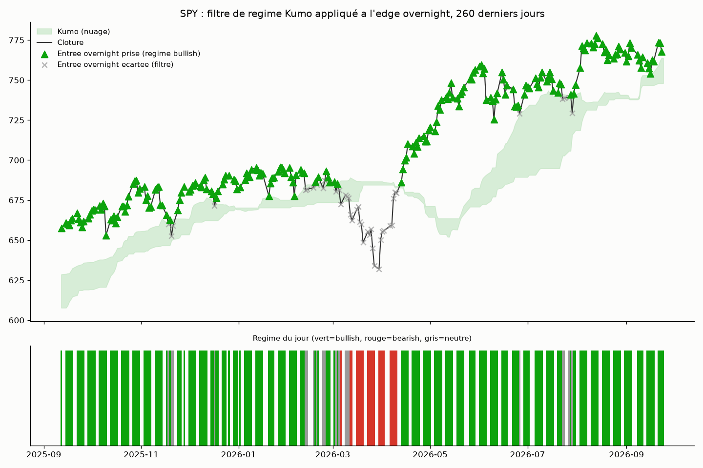

# Overnight drift filtré par régime de tendance (Kumo Ichimoku)

## L'idée

`overnight_drift_stocks/` (biais structurel close→open) a été rejeté sur 5
actions individuelles, mais `overnight_drift` (le tout premier strategy du
projet, sur indices) a survécu au protocole complet. `ichimoku_daily/` a par
ailleurs montré qu'un signal Ichimoku pur ne suffit pas comme stratégie
autonome. Question testée ici, née de la combinaison des deux enseignements
(Rule #3 — innovation par combinaison plutôt que répétition) : **le nuage
Kumo peut-il servir non pas de signal d'entrée, mais de filtre de régime**
pour ne garder que les nuits overnight où la tendance de fond (Ichimoku)
va dans le même sens que le biais structurel, en écartant les nuits à
contre-tendance ?

Univers : les 4 indices/ETF larges (SPY, QQQ, IWM, DIA) où l'edge overnight
brut est déjà établi — hypothèse principale. Les 16 autres tickers cross-asset
du panier Ichimoku (secteurs SPDR, matières premières, obligataire,
international, méga-caps) sont testés en cartographie exploratoire
secondaire, sans peser sur le verdict principal (voir Rigueur).

## Logique du mécanisme

Chaque jour J, on calcule le régime Ichimoku à la clôture de J (nuage Kumo
causal, décalé de 26 périodes, comme dans `ichimoku_daily/`) :
- **bullish** : clôture au-dessus du nuage.
- **bearish** : clôture en-dessous du nuage.
- **neutral** : clôture à l'intérieur du nuage (ou période de warmup).

Trois configurations testées :
- **unfiltered** : trade l'overnight tous les jours (baseline = stratégie
  `overnight_drift` non modifiée).
- **bullish** : ne trade l'overnight que les jours classés bullish.
- **bearish** : ne trade l'overnight que les jours classés bearish.

Le point de conception clé (Rule #2, décidé avant de regarder l'OOS) : la
config **unfiltered fait partie de la grille**, au même titre que les deux
configs filtrées. Sans cette baseline, un filtre pourrait sembler "n'importe
comment robuste" simplement parce qu'il n'est jamais comparé à l'absence de
filtre — ici, elle permet de trancher proprement si le filtre apporte
quelque chose ou non.

## Logique illustrée sur données réelles (SPY)

Nuage Kumo (vert clair), clôtures, et sur les 260 derniers jours : ▲ vert =
entrée overnight effectivement prise par le filtre bullish, ✕ gris = entrée
overnight écartée par ce même filtre (alors qu'elle aurait été prise en
unfiltered). Le bandeau du bas montre le régime du jour (vert=bullish,
rouge=bearish, gris=neutre).

## Rigueur du backtest

Voir `METHODOLOGIE.md` (racine) pour le détail de chaque test. Spécificités
de cette stratégie :

- **Sélection de la config en in-sample, sur un critère fixé avant de
  regarder l'OOS** (Rule #2) : pour chaque instrument, la meilleure config de
  la grille à 3 (`unfiltered`/`bullish`/`bearish`) est choisie par le Sharpe
  in-sample le plus élevé — jamais par le résultat OOS ou placebo.
- **Pas de fuite de futur sur le nuage** : `kumo_bounds()` réutilise le même
  calcul causal que `ichimoku_daily/` (Senkou A/B décalés de 26 périodes),
  vérifié par `test_kumo_bounds_do_not_use_future_bars`.
- **Décision d'entrée prise avant l'ouverture suivante** : le régime utilisé
  pour filtrer le trade overnight du jour J est celui calculé à la clôture de
  J, jamais influencé par un choc sur l'ouverture de J+1 — vérifié par
  `test_entry_decided_before_close_no_lookahead`.
- **9 tests unitaires** (`test_regime_filtered_backtest.py`), tous passants :
  absence de fuite de futur (nuage et décision d'entrée), neutralité du
  warmup, exhaustivité/exclusivité mutuelle des 3 régimes, `unfiltered` trade
  bien tous les jours, `bullish`/`bearish` ne tradent que leurs jours
  respectifs et sont disjoints entre eux, déterminisme et préservation du
  timing du test placebo.
- Split IS/OOS 70/30 chronologique, walk-forward 12 mois train / 3 mois
  test, test placebo (direction aléatoire, même timing filtré, Monte Carlo,
  OOS), sensibilité au slippage 0-3 ticks.
- **Correction Bonferroni hiérarchique par sous-groupe** (voir
  `ichimoku_daily/README.md` et `vocabulaire.md`) : seul le sous-groupe des 4
  indices larges (SPY/QQQ/IWM/DIA) constitue le test pertinent pour cette
  hypothèse — seuil = 0.05/4 = **0.0125**. Les 16 tickers cross-asset restants
  sont rapportés à titre de cartographie exploratoire uniquement, jamais
  mélangés au pool de correction du groupe primaire.
- **Suivi explicite de la puissance statistique** : n_trades par config
  reporté dans chaque grille (ex. SPY : n_IS=1756 en unfiltered vs 1209 en
  bullish vs 324 en bearish) — les tailles d'échantillon restent larges,
  la puissance statistique n'est pas le facteur limitant du verdict.

## Données

Réutilise les CSV journaliers déjà téléchargés pour `ichimoku_daily/`
(`download_ib_daily.py`, IB, 10 ans, 2016-09 → 2026-09) pour les 20 mêmes
tickers, dans `data_<ticker>/`.

## Résultats

### Groupe primaire (hypothèse testée)

| Instrument | Meilleure config IS | n_IS | Sharpe IS | n_OOS | Sharpe OOS | p-value placebo (OOS) |
|---|---|---|---|---|---|---|
| SPY | unfiltered | 1756 | 0.27 | 754 | 1.24 | 0.003 |
| QQQ | unfiltered | 1756 | 0.25 | 754 | 1.36 | 0.003 |
| IWM | bullish | 985 | 0.63 | 502 | 1.00 | 0.013 |
| DIA | unfiltered | 1756 | 0.27 | 754 | 0.69 | 0.040 |

Détail complet (grille des 3 configs, walk-forward fenêtre par fenêtre,
sensibilité slippage) dans `backtest_primary_group.log`.

### Groupe secondaire (cartographie exploratoire, hors verdict)

| Instrument | Meilleure config IS | Sharpe IS | Sharpe OOS | p-value placebo (OOS) |
|---|---|---|---|---|
| XLE | bearish | -0.82 | -0.15 | 0.093 |
| XLF | bearish | -0.84 | -0.90 | 0.684 |
| XLK | bearish | -0.45 | -0.10 | 0.412 |
| XLV | bearish | -0.37 | 0.01 | 0.216 |
| XLY | bullish | -0.11 | -0.19 | 0.193 |
| XLP | bearish | -0.63 | -0.26 | 0.120 |
| GLD | bearish | 0.46 | 0.01 | 0.452 |
| SLV | bullish | -0.83 | 0.36 | 0.093 |
| USO | bearish | 0.12 | 0.98 | 0.020 |
| TLT | bullish | -0.08 | -1.33 | 0.874 |
| IEF | bullish | -0.63 | -1.69 | 0.761 |
| EFA | bearish | -0.61 | 0.38 | 0.153 |
| EEM | bearish | -0.75 | 0.55 | 0.043 |
| AAPL | bullish | 0.01 | -0.04 | 0.395 |
| JPM | unfiltered | 0.12 | 0.59 | 0.070 |
| XOM | bearish | -0.22 | 0.61 | 0.060 |

Détail complet dans `backtest_secondary_group.log`. Trades détaillés dans
`trades_<TICKER>_best.csv` (20 tickers). Courbes d'équité du groupe primaire
dans `examples/equity_<TICKER>.png`.

## Constats

- **Sur 3 des 4 indices primaires (SPY, QQQ, DIA), la config préférée en
  in-sample est `unfiltered`** — le filtre de régime Kumo n'améliore pas le
  Sharpe in-sample par rapport à l'edge overnight brut, non conditionné.
  Le filtre bullish/bearish n'est donc même pas *sélectionné* comme
  meilleur que l'absence de filtre sur ces 3 instruments.
- **Seul IWM sélectionne `bullish` en in-sample** (Sharpe IS 0.63 vs 0.59 en
  unfiltered, écart faible), et son p-value placebo OOS (0.013) échoue de
  justesse le seuil Bonferroni du sous-groupe (0.0125) — à peine trop haut
  pour être retenu comme un edge distinct du hasard sur cet échantillon.
- **Les p-values les plus basses du groupe primaire (SPY, QQQ, p=0.003)
  appartiennent à la config `unfiltered`**, donc valident l'edge overnight
  déjà établi par la stratégie `overnight_drift` — elles ne soutiennent en
  rien l'hypothèse testée ici (le filtre de régime), qui prédisait
  justement que filtrer ferait mieux que ne pas filtrer.
- **Dans le groupe secondaire**, la plupart des instruments ont un Sharpe
  in-sample négatif même sur leur meilleure config — signe que l'edge
  overnight de base n'existe pas ou est de signe différent sur ces classes
  d'actifs (cohérent avec le rejet préalable de `overnight_drift_stocks/`
  sur actions individuelles). USO et EEM passent sous le seuil naïf de 0.05
  en p-value placebo, mais restent hors du périmètre de test pré-enregistré
  et ne justifient pas, à eux seuls, un second sous-groupe hiérarchique
  (pas de cohérence économique évidente entre pétrole et émergents).

## Verdict

**Rejeté.** L'hypothèse principale — le régime de tendance Kumo conditionne
ou améliore l'edge overnight structurel des indices larges — est falsifiée à
deux niveaux : (1) pour 3 des 4 instruments du groupe primaire, le filtre
n'est même pas préféré à l'absence de filtre sur le critère de sélection
in-sample fixé à l'avance ; (2) le seul instrument où il l'est (IWM) ne passe
pas le seuil de significativité Bonferroni propre à son sous-groupe. Le
edge overnight lui-même reste valide (p=0.003 sur SPY/QQQ en configuration
non filtrée) — c'est bien le filtre de régime qui échoue, pas la stratégie
`overnight_drift` sous-jacente.

## Fichiers

- `regime_filtered_backtest.py` — moteur (régime Kumo causal, grille à 3
  configs, walk-forward, test placebo, slippage).
- `test_regime_filtered_backtest.py` — 9 tests unitaires.
- `make_example_chart.py` — graphique pédagogique (nuage, régime, entrées
  prises/écartées) sur données réelles SPY.
- `data_<ticker>/` — CSV journaliers, 20 instruments (réutilisés d'Ichimoku).
- `backtest_primary_group.log` — sortie complète du protocole (SPY/QQQ/IWM/DIA).
- `backtest_secondary_group.log` — sortie complète du protocole (16 tickers
  exploratoires).
- `trades_<TICKER>_best.csv` — trades détaillés de la meilleure config IS,
  20 instruments.
- `examples/equity_<TICKER>.png` — courbes d'équité, groupe primaire.
- `examples/regime_filter_logic.png` — graphique pédagogique.
