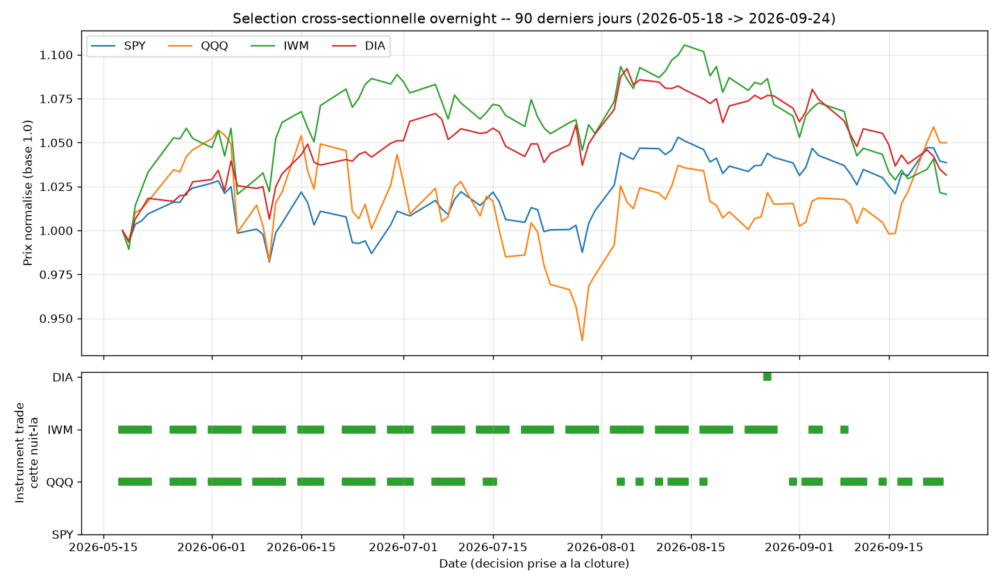

# Sélection cross-sectionnelle de l'instrument qui reçoit l'edge overnight

## L'idée

Cinq tentatives consécutives de filtre **calendaire** de l'edge overnight
(#11, #14, #15, #16, #17) ont été rejetées — cette dimension (QUAND trader un
instrument fixe) est épuisée (voir `STRATEGIES.md`, "#17 → #18"). Question
testée ici, de nature différente : au lieu de filtrer le temps, on filtre
**l'instrument** — chaque nuit, parmi les 4 indices/ETF larges où l'edge
overnight (#10) est déjà validé (SPY, QQQ, IWM, DIA), le moteur de
comparaison cross-sectionnelle construit pour le momentum (#13) peut-il
désigner LEQUEL (ou lesquels) reçoit le trade, plutôt que de trader les 4 en
parallèle chaque soir ?

Idée suggérée par l'utilisateur le 2026-09-25 : attendre que plusieurs
confirmations soient simultanément "au vert" sur un actif donné parmi
plusieurs suivis, l'actif qui déclenche pouvant changer d'un soir à l'autre.

Univers : uniquement SPY/QQQ/IWM/DIA — pas de cartographie exploratoire
secondaire ici. Étendre la sélection aux 16 autres tickers cross-asset du
projet n'aurait pas de sens : l'edge overnight lui-même y a déjà été rejeté
(`overnight_drift_stocks` #11, `overnight_drift_baskets` #15), donc il n'y a
rien à sélectionner sur ces instruments.

## Logique du mécanisme

Chaque nuit, à la clôture du jour J, pour chacun des 4 instruments :

1. **Score de force relative** — convention momentum "6-1" (lookback 6 mois,
   skip 1 mois, plus réactive que la convention académique 12-1 pour une
   décision nocturne entre 4 instruments très corrélés) :
   `score_i(J) = close_i(J-21) / close_i(J-147) - 1`. Comparaison
   cross-sectionnelle : rang de l'instrument i parmi les 4 (top-2 = "fort").
2. **Régime de tendance Kumo Ichimoku** — identique à
   `overnight_drift_regime_filtered/` (causal, décalage 26 jours) : bullish
   si clôture au-dessus du nuage.

Grille à 3 configurations (baseline obligatoire) :
- **unfiltered_baseline** : trade les 4 instruments chaque nuit (reproduit
  exactement `overnight_drift` #10).
- **cross_sectional_only** : trade uniquement les 2 instruments classés
  top-2 par score cette nuit-là (teste la sélection relative seule).
- **cross_sectional_plus_regime** : trade uniquement les instruments qui
  sont À LA FOIS top-2 ET en régime bullish (0 à 2 instruments selon les
  nuits — le mécanisme décrit par l'utilisateur).

Sélection de la config : Sharpe in-sample le plus élevé, décidé avant de
regarder l'OOS/le placebo (Rule #2).

## Logique illustrée sur données réelles

Sur les 90 derniers jours (2026-05-18 → 2026-09-24), les carrés verts
montrent quel(s) instrument(s) avaient les confirmations réunies (top-2
momentum + régime bullish) et ont reçu le trade overnight ce soir-là. On
observe bien une rotation entre instruments (IWM puis QQQ dominent, avec un
déclenchement isolé sur DIA fin août) — le mécanisme fonctionne comme
attendu mécaniquement, la question posée par le protocole est de savoir
s'il contient une information exploitable (voir Constats/Verdict).

## Rigueur du backtest

Voir `METHODOLOGIE.md` (racine) pour le détail de chaque test. Spécificités
de cette stratégie :

- **Pré-enregistrement complet avant tout résultat** (Rule #4) : le
  mécanisme (lookback 6-1, top-2, régime bullish, grille à 3 configs) a été
  figé dans un plan écrit avant le premier run — voir la section
  "Rationale" de `STRATEGIES.md` pour la version intégrale.
- **14 tests unitaires** (`test_overnight_selection_backtest.py`), tous
  passants : absence de fuite de futur sur le score momentum et sur le
  nuage Kumo (choc sur des barres futures ne change pas une valeur déjà
  calculée), warmup neutre, régime mutuellement exclusif/exhaustif,
  décision prise à la clôture de J et appliquée seulement à l'ouverture de
  J+1, `unfiltered_baseline` trade bien les 4 instruments toutes les nuits,
  `cross_sectional_only` ne trade jamais plus de `n_top` et toujours les
  mieux classés, `cross_sectional_plus_regime` est un sous-ensemble strict
  de `cross_sectional_only`, placebo déterministe et préservant le nombre
  d'instruments sélectionnés par nuit.
- Split IS/OOS 70/30 chronologique (IS : 2016-09-27 → 2023-09-20 ; OOS :
  2023-09-21 → 2026-09-23), walk-forward 12 mois train / 3 mois test,
  **test placebo de sélection aléatoire** (même nombre d'instruments
  retenus par nuit, mais choisis au hasard au lieu d'être classés — isole
  si le CLASSEMENT apporte une info, la direction/fenêtre étant déjà
  validées par #10), sensibilité au slippage 0-3 ticks.
- **Multiple-testing** : grille de 3 configs testées sur le MÊME
  portefeuille (pas de diversité cross-asset ici, une seule question
  structurelle posée 3 fois) → correction globale standard, seuil
  0.05/3 ≈ **0.0167** — pas de correction hiérarchique par sous-groupe
  nécessaire (pas de cartographie secondaire, voir "L'idée").
- **Suivi explicite de la perte de puissance** : `unfiltered_baseline`
  trade 7024 instrument-nuits en IS (4 × 1756, référence #10/#14) ;
  `cross_sectional_only` seulement 3218 (2.0 instruments/nuit en moyenne) ;
  `cross_sectional_plus_regime` seulement 2206 (1.82 instruments/nuit en
  moyenne) — la config gagnante trade ~31 % du volume de la baseline.
- **Vérification que le mécanisme n'est pas juste Kumo #14 déguisé** : la
  grille distingue explicitement `cross_sectional_only` (sélection relative
  pure, sans régime) de `cross_sectional_plus_regime` — voir Constats.

## Données

Réutilise les CSV journaliers déjà téléchargés pour `ichimoku_daily/`/
`overnight_drift_regime_filtered/` (IB, 10 ans, 2016-09 → 2026-09),
`data_<ticker>/`. 2512 jours communs aux 4 instruments, calendrier
identique vérifié avant tout calcul.

## Résultats

### Grille (3 configurations, IS/OOS)

| Config | n_IS | avg sélectionné/nuit (IS) | Sharpe IS | t-stat IS | n_OOS | Sharpe OOS |
|---|---|---|---|---|---|---|
| unfiltered_baseline | 7024 | 4.00 | 0.335 | 0.884 | 3016 | 1.191 |
| cross_sectional_only | 3218 | 2.00 | 0.336 | 0.888 | 1508 | 1.227 |
| **cross_sectional_plus_regime** | 2206 | 1.82 | **0.445** | 1.174 | 1078 | 1.499 |

### Meilleure config in-sample : `cross_sectional_plus_regime`

| Période | n_trades | avg sélectionné/nuit | Win rate | Exp($) | Profit factor | Sharpe | t-stat | Max DD($) |
|---|---|---|---|---|---|---|---|---|
| IS | 2206 | 1.82 | 54 % | 5.61 | 1.10 | 0.44 | 1.17 | -10 217 |
| OOS | 1078 | 1.82 | 58 % | 29.54 | 1.35 | 1.50 | 2.59 | -6 615 |

### Walk-forward (train 12 mois / test 3 mois, 34 fenêtres)

Concaténation des périodes de test : n=5079, Sharpe=0.60, t-stat=1.79,
total=49 005$. La config sélectionnée change fréquemment d'une fenêtre à
l'autre (`unfiltered_baseline` domine 2017-2019, `cross_sectional_only` et
`cross_sectional_plus_regime` alternent ensuite) — détail complet dans
`backtest_all.log`.

### Sensibilité au slippage (meilleure config, toute la période)

| Slippage | n_trades | Sharpe | t-stat |
|---|---|---|---|
| 0 tick | 3285 | 0.99 | 3.13 |
| 1 tick | 3285 | 0.86 | 2.73 |
| 2 ticks | 3285 | 0.74 | 2.32 |
| 3 ticks | 3285 | 0.61 | 1.92 |

### Test placebo — sélection aléatoire (hors-échantillon, 300 simulations)

| Réel | Sélection aléatoire (même nombre/nuit) | p-value |
|---|---|---|
| 31 846 $ | 28 606 $ ± 3 534 $ | **0.183** |

## Constats

- **La grille IS ne départage presque pas `unfiltered_baseline` et
  `cross_sectional_only`** (Sharpe 0.335 vs 0.336, quasiment identiques) :
  la sélection cross-sectionnelle PURE (sans régime) n'apporte rien de
  mesurable en in-sample. Toute l'amélioration de Sharpe IS de la config
  gagnante (0.335 → 0.445) vient de l'intersection avec le régime Kumo, pas
  du classement relatif entre instruments — signal d'alerte direct sur le
  point de vigilance #3 du plan (le mécanisme pourrait être une resucée du
  filtre Kumo #14, pas une innovation par sélection d'instrument).
- **Le Sharpe OOS (1.50) et le walk-forward (0.60) de la config gagnante
  semblent bons pris isolément** — mais c'est précisément le cas que le test
  placebo est conçu pour démasquer (voir `METHODOLOGIE.md` section 7) :
  une bonne structure de risque (bon timing overnight, déjà hérité de #10)
  peut produire un Sharpe positif même si le critère de sélection
  lui-même n'apporte aucune information.
- **Le test placebo tranche sans ambiguïté** : sur la période OOS, le P&L
  réel (31 846$) n'est qu'à ~0.9 écart-type de la moyenne d'une sélection
  aléatoire du même nombre d'instruments par nuit (28 606$ ± 3 534$),
  p=0.183 — très loin du seuil Bonferroni du grid search (0.05/3≈0.0167,
  et même du seuil naïf 0.05). Le classement par score de momentum 6-1
  entre ces 4 instruments n'apporte pas d'information exploitable sur quel
  actif recevra le meilleur trade overnight cette nuit-là.
- **Interprétation économique, pas seulement statistique** : SPY, QQQ, IWM
  et DIA partagent la même exposition structurelle (marché actions US
  large), fortement corrélée — l'edge overnight identifié en #10 est
  systémique (flux hors séance communs aux 4), pas idiosyncratique à un
  instrument. Un classement de force relative à court terme entre 4
  expositions quasi-identiques n'a pas de raison a priori de prédire LEQUEL
  bénéficiera le plus du même flux structurel la nuit suivante — ce que le
  test placebo confirme empiriquement. C'est cohérent avec l'échec de
  #14 (Kumo comme filtre temporel) et de #13 (momentum cross-sectionnel
  comme signal autonome) : ni la tendance ni le momentum ne semblent
  porter d'information exploitable sur ce panier précis d'indices larges,
  qu'ils soient utilisés comme filtre temporel, comme signal autonome, ou
  maintenant comme critère de sélection d'instrument.
- **Perte de puissance confirmée mais non déterminante ici** : la config
  gagnante ne trade que 31 % du volume d'instrument-nuits de la baseline
  (2206 vs 7024) — la taille d'échantillon OOS (1078 trades) reste large,
  ce n'est donc pas un manque de puissance statistique qui explique le
  rejet, mais l'absence réelle de signal dans le critère de sélection.

## Verdict

**Rejeté.** La config gagnante en in-sample (`cross_sectional_plus_regime`)
échoue le critère de décision global de `METHODOLOGIE.md` sur deux points
décisifs : (3) p-value du test placebo hors-échantillon = 0.183, très loin
du seuil naïf (0.05) et a fortiori du seuil Bonferroni du grid search
(0.05/3≈0.0167) ; (5) même en ignorant le placebo, aucune config de la
grille n'atteindrait ce seuil sur le critère de sélection lui-même (t-stat
IS max = 1.17, très insuffisant). Le Sharpe OOS/walk-forward positif de la
config gagnante ne reflète pas une information réelle dans la sélection
cross-sectionnelle, mais hérite simplement de la bonne structure de risque
de l'edge overnight #10 sous-jacent — exactement le type de faux signal que
le test placebo est destiné à détecter. **L'edge overnight #10 lui-même
reste valide** ; c'est bien le mécanisme de sélection d'instrument qui
échoue, pas la stratégie sous-jacente.

Sixième dimension testée pour combiner/améliorer l'edge overnight (après 5
filtres calendaires #11/#14/#15/#16/#17) à échouer — voir "Enseignements
transversaux" dans `STRATEGIES.md` pour la conséquence de conception à en
tirer avant la stratégie #19.

## Fichiers

- `overnight_selection_backtest.py` — moteur (scores momentum causaux,
  régime Kumo causal, grille à 3 configs, walk-forward, placebo de
  sélection aléatoire, sensibilité slippage).
- `test_overnight_selection_backtest.py` — 14 tests unitaires.
- `make_example_chart.py` — graphique pédagogique (rotation d'instrument
  sélectionné, 90 derniers jours réels).
- `data_{spy,qqq,iwm,dia}/` — CSV journaliers, 4 instruments.
- `backtest_all.log` — sortie complète du protocole.
- `trades_best.csv` — trades détaillés de la config gagnante IS.
- `examples/equity_best.png` — courbe de P&L cumulé.
- `examples/selection_logic.png` — graphique pédagogique.
