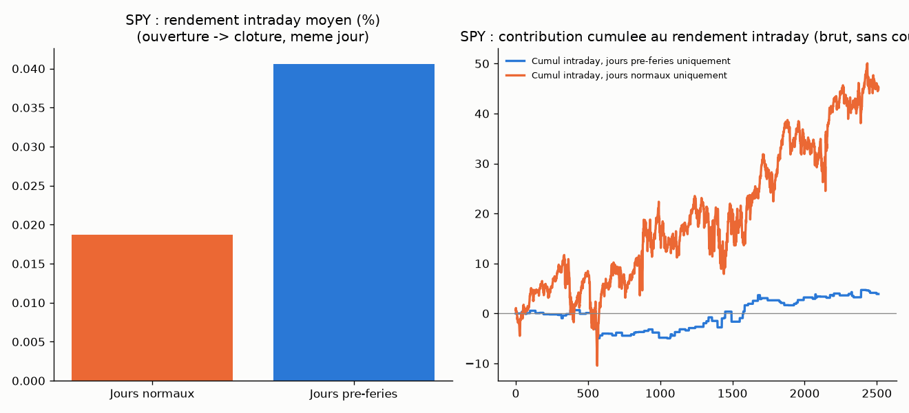

# Effet pré-jour-férié (pre-holiday effect) sur la jambe intraday

## L'idée

Après quatre tentatives de généraliser ou de filtrer `overnight_drift` (#11,
#14, #15, #16 — actions individuelles, filtre de tendance, ETF-paniers,
turn-of-month), toutes rejetées, le "Bilan" de `STRATEGIES.md` conclut que
l'edge overnight sur SPY/QQQ/IWM/DIA est une propriété globale et
inconditionnelle sur la période testée : le sous-diviser davantage détruit la
puissance statistique sans jamais isoler un sous-ensemble qui le surpasse.
Continuer à chercher un filtre de cet edge aurait retesté la même piste une
5ᵉ fois (contraire à Rule #3).

Deux premières pistes de remplacement ont été envisagées et écartées **avant
tout codage** (Rule #4, voir `STRATEGIES.md`) : le retournement à très court
terme (signal basé sur la magnitude du prix, contredit l'enseignement
transversal "les signaux de niveau/rang de prix échouent systématiquement sur
ce projet") et l'effet jour-de-la-semaine comme 5ᵉ filtre calendaire de l'edge
overnight (prolongeait une classe de filtres déjà rejetée 4 fois).

La piste retenue — l'effet **pré-jour-férié** (Ariel, 1990) — est une
différence structurelle, pas cosmétique : elle teste un edge sur la jambe
**intraday** (ouverture → clôture, séance ouverte), jamais utilisée comme
source d'edge dans ce projet, plutôt que de conditionner une fois de plus la
jambe overnight déjà validée par #10. Purement calendaire (jours fériés
connus à l'avance), sans indicateur ni classement de prix — cohérent avec
l'enseignement transversal du projet.

## Logique du mécanisme

Un jour est marqué "pré-férié" si le jour ouvré suivant (lundi-vendredi)
n'apparaît pas dans le calendrier de bourse reconstruit à partir des dates
réellement présentes dans les données de l'instrument — c'est-à-dire que le
marché a été fermé pour une raison autre qu'un week-end normal. Détection
**purement calendaire, sans dépendance au prix** (vérifié par un test dédié),
et volontairement sans bibliothèque de jours fériés externe :
`pandas.tseries.holiday.USFederalHolidayCalendar` inclurait des jours fériés
fédéraux où le NYSE reste ouvert (Columbus Day, Veterans Day) et manquerait
Good Friday (fermé au NYSE, pas un jour férié fédéral) — la détection par
trou dans le calendrier de bourse réel évite ce décalage, dans le même esprit
que `tom_membership()` de la stratégie #16.

Grille à 3 configurations, sélectionnée en in-sample sur le Sharpe le plus
élevé, jamais choisie après coup (Rule #2) :
- `unfiltered` = rendement intraday brut, aucun filtre (référence directe) ;
- `pre_holiday_only` = ne trade que les jours pré-fériés ;
- `non_pre_holiday_only` = ne trade que les jours normaux.

**Auto-critique actée avant codage** (Rule #4) : (1) le nombre de jours
fériés US par an (~9-10) rend le nombre de trades pré-fériés mécaniquement
faible — risque de perte de puissance statistique encore plus sévère que
#16 ; (2) un jour pré-férié tombe souvent en fin de semaine (ponts) —
l'effet mesuré pourrait redire l'effet vendredi/weekend déjà écarté avant
codage, à surveiller explicitement dans les Constats.

## Logique illustrée sur données réelles (SPY)

Rendement intraday moyen brut (sans coûts) : jours pré-fériés = **+0.0406 %**
(n=96) contre jours normaux = **+0.0187 %** (n=2416) — un écart brut existe
dans le sens attendu par la littérature sur cette lecture simple ; le
graphique de droite montre les deux contributions cumulées côte à côte sur
l'historique complet. Le protocole complet ci-dessous (coûts, IS/OOS,
walk-forward, placebo) détermine si cet écart brut survit à un test rigoureux.

## Rigueur du backtest

Voir `METHODOLOGIE.md` (racine) pour le détail de chaque test. Spécificités
de cette stratégie :

- **Définition pré-fériée purement calendaire** : ne dépend que du calendrier
  de bourse reconstruit, jamais d'une donnée de prix — vérifié par
  `test_pre_holiday_membership_is_purely_calendar_based_no_price_dependence`
  et `test_no_lookahead_removing_a_future_trading_day_does_not_change_past_flags`
  (un changement loin dans le futur du calendrier ne modifie jamais le
  marquage d'un jour passé — seul le jour ouvré immédiatement suivant compte).
- **12 tests unitaires** (`test_pre_holiday_backtest.py`), tous passants :
  détection correcte d'un trou calendaire, dernier jour de la série jamais
  marqué pré-férié (pas d'extrapolation), jambe intraday utilisant bien
  open[i]/close[i] du même jour (jamais close[i]→open[i+1], la jambe
  overnight déjà testée ailleurs), absence de fuite de futur, exclusivité
  mutuelle et complémentarité de `pre_holiday_only`/`non_pre_holiday_only`,
  effet du slippage, déterminisme et préservation du timing du test placebo.
- Split IS/OOS 70/30 chronologique, walk-forward 12 mois train / 3 mois test,
  test placebo (direction aléatoire, même filtre, Monte Carlo n=300, OOS),
  sensibilité au slippage 0-3 ticks.
- **Auto-critiques pré-enregistrées, mesurées** : 96 jours pré-fériés détectés
  sur l'historique complet (3.8 %), soit 65 trades in-sample / 31 hors-
  échantillon par instrument — le plus petit échantillon de tout le projet à
  ce jour (contre ~254 pour #16) ; **54.2 %** de ces jours pré-fériés sont
  eux-mêmes des vendredis (53.4 % pour IEF, historique plus court) — le
  confound weekend pré-enregistré est donc bien réel et discuté ci-dessous.
- **Correction Bonferroni hiérarchique par sous-groupe** (cartographie
  cross-asset) : hypothèse principale sur les 4 indices larges (sous-groupe
  a priori déjà défini pour #12/#14/#16), seuil = 0.05/4 = 0.0125. Les 16
  instruments restants sont une cartographie exploratoire secondaire, jamais
  mélangée au verdict principal — cohérent avec `METHODOLOGIE.md` section 5.
  Contrairement à #16, l'hypothèse pré-férié n'est **pas** restreinte a
  priori au sous-groupe indices (elle porte sur un mécanisme intraday
  distinct de l'edge overnight déjà borné à ce sous-groupe) — les 4 indices
  restent néanmoins rapportés séparément par souci de comparabilité.
- **Correction multiple-testing du grid search lui-même** (distincte de la
  précédente — voir `STRATEGIES.md` "Enseignements transversaux", #13) : la
  grille de 3 configurations testées sur le **même** instrument est une
  seule hypothèse posée 3 fois, donc soumise à une correction Bonferroni
  classique, seuil = 0.05/3 ≈ 0.0167 — appliquée à la p-value du placebo de
  la config retenue, en plus (pas à la place) de la correction hiérarchique
  ci-dessus quand l'instrument appartient au sous-groupe primaire.

## Données

Réutilise les CSV journaliers déjà téléchargés pour `ichimoku_daily/` (mêmes
20 tickers, mêmes fichiers `data_<ticker>/<TICKER>_daily_all.csv`).

## Résultats

### Hypothèse principale — indices/ETF larges US

| Instrument | Config IS | n_IS | Sharpe IS | t-stat IS | n_OOS | Sharpe OOS | Sharpe WF | p-value placebo (OOS) |
|---|---|---|---|---|---|---|---|---|
| SPY | pre_holiday_only | 65 | 0.24 | 0.63 | 31 | 0.21 | -0.05 | 0.349 |
| QQQ | pre_holiday_only | 65 | 0.19 | 0.51 | 31 | -0.24 | -0.18 | 0.671 |
| IWM | pre_holiday_only | 65 | 0.06 | 0.16 | 31 | 0.43 | -0.61 | 0.209 |
| DIA | pre_holiday_only | 65 | 0.02 | 0.04 | 31 | 0.26 | -0.15 | 0.312 |

### Cartographie exploratoire secondaire — 16 instruments cross-asset

| Instrument | Config IS | Sharpe IS | Sharpe OOS | Sharpe WF | p-value placebo (OOS) |
|---|---|---|---|---|---|
| XLP | pre_holiday_only | -0.07 | 1.01 | -0.11 | 0.020 |
| AAPL | unfiltered | 0.37 | 1.15 | 0.58 | 0.017 |
| GLD | pre_holiday_only | 0.42 | 0.00 | -0.31 | 0.472 |
| JPM | pre_holiday_only | 0.30 | 0.53 | -0.16 | 0.183 |
| XLF | pre_holiday_only | -0.01 | 0.52 | -0.35 | 0.063 |
| TLT | pre_holiday_only | 0.22 | -0.60 | -0.45 | 0.708 |
| EFA | pre_holiday_only | -0.02 | 0.75 | -0.56 | 0.053 |
| USO | pre_holiday_only | 0.10 | 0.12 | -0.11 | 0.342 |
| XLV | pre_holiday_only | 0.14 | 0.18 | -0.45 | 0.279 |
| XLK | pre_holiday_only | 0.02 | -0.37 | -0.50 | 0.711 |
| EEM | pre_holiday_only | -0.50 | 0.51 | -0.65 | 0.086 |
| IEF | pre_holiday_only | -0.07 | -0.58 | -0.29 | 0.412 |
| SLV | pre_holiday_only | -0.07 | -0.17 | -0.22 | 0.551 |
| XLY | pre_holiday_only | 0.14 | -0.55 | -0.58 | 0.767 |
| XLE | pre_holiday_only | -0.47 | 0.34 | -0.17 | 0.140 |
| XOM | non_pre_holiday_only | -0.36 | -0.13 | -0.03 | 0.375 |

Détail complet (grille des 3 configurations, walk-forward fenêtre par
fenêtre, sensibilité slippage) dans `backtest_all.log`. Trades détaillés dans
`trades_<TICKER>_best.csv`. Courbes d'équité dans `examples/equity_<TICKER>.png`.

## Constats

- **Les 4 indices primaires sélectionnent tous `pre_holiday_only` en
  in-sample**, mais avec un Sharpe à peine positif et un t-stat qui ne
  dépasse jamais 0.63 (SPY) — contrairement à #16 où IWM atteignait t=2.47,
  ici même le critère 1 du protocole n'est rempli que faiblement. L'OOS est
  hétérogène (deux positifs modestes, un négatif, un quasi nul) et le
  **walk-forward est négatif pour les 4** (-0.05 à -0.61) — à la différence
  de #16 où le WF primaire était positif mais s'expliquait par un
  changement de config vers `unfiltered`/`non_tom_only` en cours
  d'historique ; ici le rejet est cohérent à toutes les étapes, sans signal
  contradictoire à interpréter. Le **test placebo ne descend jamais sous
  0.05** sur les 4 indices (0.209 à 0.671) — la direction réelle des jours
  pré-fériés n'apporte aucune information mesurable par rapport au hasard.
- **XLP est le seul résultat sous le seuil naïf de 0.05** (p=0.020) dans la
  cartographie secondaire, mais avec un **Sharpe in-sample négatif**
  (-0.07, t=-0.20) — la config `pre_holiday_only` n'est retenue que parce
  qu'elle est la *moins mauvaise* des 3, pas parce qu'elle est positive.
  C'est exactement le cas déjà documenté pour `vwap_reversion` (p=0.003 mais
  rejeté car Sharpe OOS/WF négatif) : une p-value basse ne suffit jamais si
  le critère 1 (Sharpe IS positif) échoue — le résultat OOS positif de XLP
  est un artefact de sélection sur un échantillon de 65 trades, pas une
  confirmation. XLP échoue en outre la correction multiple-testing du grid
  search lui-même (seuil 0.05/3 ≈ 0.0167, p=0.020 > 0.0167) — deux raisons
  indépendantes de l'écarter.
- **AAPL et XOM ne testent pas l'hypothèse pré-férié** : AAPL sélectionne
  `unfiltered` (le filtre pré-férié n'a pas été retenu comme meilleur en IS)
  et son placebo positif (p=0.017) concerne donc l'edge intraday brut
  d'AAPL sur la période, pas un effet pré-férié spécifique. XOM sélectionne
  `non_pre_holiday_only` (l'inverse du filtre testé). Ni l'un ni l'autre ne
  compte comme évidence pour ou contre l'hypothèse #17.
- **Le confound weekend pré-enregistré est confirmé mais sans conséquence
  pratique** : 54.2 % des jours pré-fériés sont des vendredis. Comme aucun
  résultat ne survit au protocole (ni sur le groupe primaire, ni sur XLP une
  fois le critère 1 appliqué), il n'est pas nécessaire de démêler plus
  finement la part vendredi/pré-férié — il n'y a pas d'effet à expliquer.
- **Échantillon confirmé comme le plus petit du projet** : 65 trades IS / 31
  OOS par instrument (contre ~254 pour #16, ~1750/750 pour l'edge overnight
  non filtré) — cohérent avec l'auto-critique pré-enregistrée, ce qui rend
  d'autant plus attendu qu'aucun signal ne se dégage avec une puissance
  statistique aussi faible.

## Verdict

**Rejeté.** Aucun des 20 instruments testés ne remplit simultanément les
critères du protocole (Sharpe IS positif significatif, cohérence OOS/
walk-forward, placebo p<0.05, robustesse au slippage, et correction
multiple-testing appropriée). Sur le sous-groupe principal (SPY/QQQ/IWM/DIA),
le Sharpe in-sample est à peine positif, le walk-forward est négatif pour les
4 et le test placebo ne s'approche jamais de la significativité. Sur la
cartographie exploratoire secondaire, le seul résultat sous le seuil naïf de
0.05 (XLP) est écarté par son propre Sharpe in-sample négatif et échoue en
outre la correction multiple-testing du grid search. L'effet pré-jour-férié,
testé ici pour la première fois du projet comme edge autonome sur la jambe
intraday (plutôt que comme filtre de l'edge overnight), ne se généralise à
aucun instrument. Cette question est donc close pour ce projet, au même
titre que les 4 tentatives précédentes de filtrage/extension de l'edge
overnight.

## Fichiers

- `pre_holiday_backtest.py` — moteur (grille 3 configs unfiltered/
  pre_holiday_only/non_pre_holiday_only, walk-forward, test placebo,
  slippage), détection pré-fériée purement calendaire.
- `test_pre_holiday_backtest.py` — 12 tests unitaires.
- `make_example_chart.py` — graphique pédagogique pré-férié vs normal sur
  données réelles (SPY).
- `data_<ticker>/` — CSV journaliers, 20 instruments (réutilisés
  d'Ichimoku/momentum/regime_filtered/turn_of_month).
- `backtest_all.log` — sortie complète du protocole (20 instruments).
- `trades_<TICKER>_best.csv` — trades détaillés de la meilleure config IS,
  20 instruments.
- `examples/equity_<TICKER>.png` — courbes d'équité, 20 instruments.
- `examples/pre_holiday_vs_non_pre_holiday.png` — graphique pédagogique.
