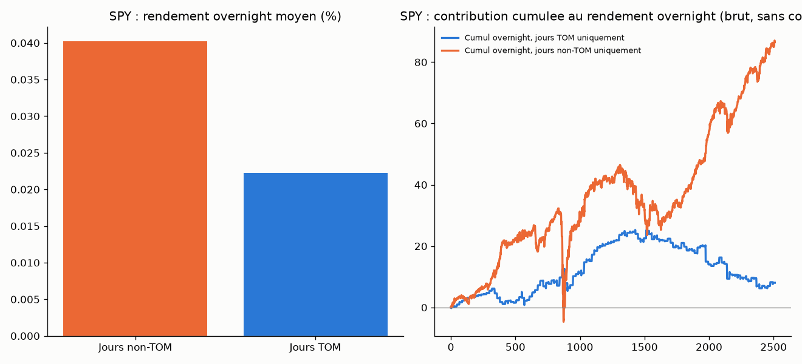

# Effet turn-of-month (TOM) sur indices/ETF actions larges et panier cross-asset

## L'idée

Les trois tentatives précédentes de généraliser `overnight_drift` (#10, seul
edge validé du projet) ont toutes échoué : actions individuelles (#11),
filtre de régime de tendance Kumo (#14), ETF-paniers hors indices actions
larges (#15). Ces trois échecs cherchaient à **étendre** le même edge
(overnight sur indices US larges) à un autre périmètre, sans jamais tester un
**second biais calendaire indépendant**. La littérature académique documente
un tel biais, distinct de l'overnight drift : l'effet **turn-of-month** (Ariel
1987 ; Lakonishok & Smidt 1988) — une part disproportionnée du rendement
moyen des actions se concentre sur les jours de bourse autour du changement
de mois (dernier jour du mois + 3 premiers jours du mois suivant), attribuée
aux flux de rebalancement institutionnels et aux cotisations mensuelles
(plans d'épargne, fonds de pension). C'est une piste **nouvelle** (Rule #3 :
innovation par combinaison plutôt que confirmer/infirmer indéfiniment la même
piste), pas une variante de plus de l'overnight drift déjà testé.

Hypothèse principale : sous-groupe des 4 indices/ETF larges US déjà validés
pour `overnight_drift` (SPY, QQQ, IWM, DIA). Cartographie exploratoire
secondaire : 16 instruments cross-asset restants du panier des 20
(secteurs SPDR, matières premières, obligataire, international, méga-caps).

## Logique du mécanisme

Même structure overnight que `overnight_drift` (entrée à la clôture du jour
J, sortie à l'ouverture du jour J+1), mais l'entrée n'est prise que sur les
jours appartenant à la **fenêtre calendaire turn-of-month** — transposition
de la définition académique (dernier jour de bourse du mois + 3 premiers
jours du mois suivant) à une structure de trading overnight-only : jambe
overnight démarrant au dernier jour du mois, ou au 1er/2e jour de bourse du
mois (couvrant ainsi la fenêtre de 4 jours en 3 transitions overnight). Grille
à 3 configurations, sélectionnée en in-sample sur le Sharpe le plus élevé,
jamais choisie après coup (Rule #2) :
- `unfiltered` = overnight_drift original, aucun filtre (référence directe) ;
- `tom_only` = ne trade que les jours TOM ;
- `non_tom_only` = ne trade que les jours hors TOM.

**Auto-critique actée avant codage** (Rule #4, documentée dans
`STRATEGIES.md` #15→#16) : le turn-of-month et l'overnight drift ne sont pas
nécessairement indépendants — si l'edge overnight déjà validé se concentre en
fait sur les jours de fin/début de mois, mesurer le rendement overnight brut
des seuls jours TOM redécouvrirait #10, pas un nouveau biais. La comparaison
`tom_only` vs `non_tom_only` vs `unfiltered` (le baseline connu) isole
précisément cette question : si `tom_only` ne bat pas nettement `unfiltered`
ET que `non_tom_only` n'est pas nettement pire, la composante TOM spécifique
n'apporte rien au-delà de l'edge overnight déjà connu.

## Logique illustrée sur données réelles (SPY)

Rendement overnight moyen brut (sans coûts) : jours TOM = **+0.0222 %**
(n=362) contre jours non-TOM = **+0.0402 %** (n=2149) — dès la lecture brute,
la fenêtre TOM ne se distingue pas favorablement du reste du calendrier sur
SPY ; le graphique de droite montre les deux contributions cumulées côte à
côte sur l'historique complet.

## Rigueur du backtest

Voir `METHODOLOGIE.md` (racine) pour le détail de chaque test. Spécificités
de cette stratégie :

- **Définition de la fenêtre TOM purement calendaire** : l'appartenance TOM
  d'un jour ne dépend que de son rang dans le mois (calendaire), jamais d'une
  donnée de marché — structurellement exempte de toute fuite de futur, vérifié
  par `test_tom_membership_is_purely_calendar_based_no_price_dependence`.
- **13 tests unitaires** (`test_turn_of_month_backtest.py`), tous passants :
  définition correcte des jours d'entrée TOM (dernier jour du mois, 1er/2e
  jour du mois suivant — le 3e jour du mois n'est jamais un jour d'entrée),
  jambe overnight correctement calculée, absence de fuite de futur, exclusivité
  mutuelle et complémentarité de `tom_only`/`non_tom_only`, effet du slippage,
  déterminisme et préservation du timing du test placebo.
- Split IS/OOS 70/30 chronologique, walk-forward 12 mois train / 3 mois test,
  test placebo (direction aléatoire, même timing/filtre, Monte Carlo, OOS),
  sensibilité au slippage 0-3 ticks.
- **Correction Bonferroni hiérarchique par sous-groupe** : hypothèse
  principale sur les 4 indices larges (déjà le sous-groupe a priori défini
  pour #12/#14), seuil = 0.05/4 = 0.0125. Les 16 instruments restants sont
  une cartographie exploratoire secondaire, jamais mélangée au verdict
  principal — cohérent avec `METHODOLOGIE.md` section 5.

## Données

Réutilise les CSV journaliers déjà téléchargés pour `ichimoku_daily/`
(mêmes 20 tickers, mêmes fichiers `data_<ticker>/<TICKER>_daily_all.csv`).

## Résultats

### Hypothèse principale — indices/ETF larges US

| Instrument | Config IS | n_IS | Sharpe IS | t-stat IS | n_OOS | Sharpe OOS | Sharpe WF | p-value placebo (OOS) |
|---|---|---|---|---|---|---|---|---|
| SPY | tom_only | 254 | 0.60 | 1.59 | 108 | -0.93 | 1.17 | 0.934 |
| QQQ | tom_only | 254 | 0.25 | 0.66 | 108 | -0.81 | 0.96 | 0.904 |
| IWM | tom_only | 254 | 0.94 | 2.47 | 108 | -1.19 | 1.09 | 0.967 |
| DIA | tom_only | 254 | 0.70 | 1.85 | 108 | -0.85 | 0.82 | 0.910 |

### Cartographie exploratoire secondaire — 16 instruments cross-asset

| Instrument | Config IS | Sharpe IS | Sharpe OOS | Sharpe WF | p-value placebo (OOS) |
|---|---|---|---|---|---|
| USO | tom_only | 1.15 | 0.02 | 0.07 | 0.359 |
| XLE | tom_only | 0.64 | -0.48 | -0.45 | 0.512 |
| XOM | tom_only | 0.51 | 0.11 | -0.23 | 0.319 |
| EEM | tom_only | 0.44 | -0.31 | -0.29 | 0.462 |
| JPM | tom_only | 0.40 | -1.16 | 0.68 | 0.980 |
| GLD | tom_only | 0.37 | 0.82 | 0.50 | 0.080 |
| EFA | tom_only | 0.33 | -0.56 | -0.33 | 0.711 |
| XLV | tom_only | 0.31 | -1.02 | -0.16 | 0.884 |
| XLY | tom_only | 0.12 | -1.30 | 0.29 | 0.987 |
| AAPL | tom_only | 0.14 | -1.15 | -0.25 | 0.970 |
| XLF | tom_only | -0.10 | -1.70 | -0.55 | 0.967 |
| XLK | tom_only | -0.21 | -0.89 | 0.77 | 0.877 |
| SLV | tom_only | -0.31 | 0.46 | -0.02 | 0.156 |
| TLT | non_tom_only | -0.52 | -1.76 | -0.28 | 0.884 |
| XLP | tom_only | -0.86 | -1.32 | -1.07 | 0.728 |
| IEF | non_tom_only | -1.43 | -1.88 | -1.12 | 0.272 |

Détail complet (grille des 3 configurations, walk-forward fenêtre par
fenêtre, sensibilité slippage) dans `backtest_all.log`. Trades détaillés dans
`trades_<TICKER>_best.csv`. Courbes d'équité dans `examples/equity_<TICKER>.png`.

## Constats

- **Les 4 indices primaires sélectionnent tous `tom_only` en in-sample avec un
  Sharpe positif** (0.25 à 0.94, IWM avec t-stat=2.47) — le critère 1 du
  protocole passe, contrairement à la plupart des tickers testés dans #15.
  Mais **les 4 s'effondrent en OOS avec un Sharpe négatif** (-0.81 à -1.19) —
  signe opposé à l'IS, échec net du critère 2. Et surtout, **le test placebo
  donne des p-values proches de 1 (0.90 à 0.97)** : sur la période
  hors-échantillon, la position réelle (systématiquement longue) fait *moins
  bien* que la quasi-totalité des 300 simulations à direction aléatoire —
  pas seulement "pas mieux que le hasard", mais nettement pire. C'est un
  signal de sur-ajustement classique : la sélection sur ~254 trades in-sample
  a capté du bruit, pas un edge réel.
- **Le Sharpe walk-forward est positif pour les 4 indices (0.82 à 1.17)**, ce
  qui pourrait sembler contredire le point précédent — mais l'examen du log
  détaillé montre que le walk-forward change fréquemment de configuration
  sélectionnée au fil des fenêtres glissantes (`tom_only` en début
  d'historique, `non_tom_only` ou `unfiltered` à partir de 2021-2023 pour
  SPY). Le walk-forward teste ici la capacité du grid à s'adapter dans le
  temps entre 3 configurations dont l'une (`unfiltered`) est déjà l'edge
  overnight validé — un Sharpe walk-forward positif ne valide donc pas
  spécifiquement l'hypothèse TOM, il peut simplement refléter que
  `non_tom_only`/`unfiltered` (qui diluent ou ignorent le filtre TOM)
  dominent la période récente. Seul le test IS-statique + OOS + placebo
  (criètres 2 et 3 de `METHODOLOGIE.md`) évalue directement l'hypothèse
  testée, et il rejette sans ambiguïté.
- **Aucun instrument de la cartographie secondaire ne passe le critère 3**
  (placebo p < 0.05) même sans aucune correction multiple-testing : le
  meilleur cas (GLD, p=0.080) reste au-dessus du seuil non corrigé. La
  correction Bonferroni hiérarchique (0.05/4 pour le groupe primaire) est
  donc sans objet — le rejet est net avant même de l'appliquer.
- **Cohérent avec l'auto-critique pré-enregistrée** : la comparaison
  `tom_only` vs `unfiltered` montre que le filtre TOM ne bat pas
  systématiquement l'edge non filtré en OOS (ex. SPY : `unfiltered` a un
  Sharpe OOS de 1.24 contre -0.93 pour `tom_only`, cf. `backtest_all.log`) —
  la composante TOM spécifique n'ajoute donc rien à l'edge overnight déjà
  connu ; elle en dilue même la performance quand on restreint le trading à
  cette seule fenêtre.

## Verdict

**Rejeté.** L'hypothèse d'un biais calendaire turn-of-month distinct de
l'overnight drift déjà validé n'est confirmée sur aucun des 20 instruments
testés. Sur le sous-groupe principal (SPY/QQQ/IWM/DIA), la configuration
`tom_only` est certes sélectionnée en in-sample avec un Sharpe positif, mais
s'effondre en hors-échantillon (signe opposé) et échoue de façon décisive le
test placebo (p=0.90-0.97, la direction réelle faisant nettement moins bien
que le hasard) — signature classique de sur-ajustement sur un échantillon
in-sample de ~254 trades. Sur la cartographie exploratoire secondaire, aucun
des 16 instruments restants ne passe le seuil de significativité même non
corrigé. Après quatre tentatives de généralisation ou de combinaison de
l'edge overnight (#11, #14, #15, #16), la question est considérée close pour
ce projet (Rule #3) : l'edge original (#10) reste isolé sur les indices/ETF
actions larges US, sans filtre ni fenêtre calendaire additionnelle
identifiée qui l'améliore.

## Fichiers

- `turn_of_month_backtest.py` — moteur (grille 3 configs unfiltered/tom_only/
  non_tom_only, walk-forward, test placebo, slippage), fenêtre TOM purement
  calendaire.
- `test_turn_of_month_backtest.py` — 13 tests unitaires.
- `make_example_chart.py` — graphique pédagogique TOM vs non-TOM sur données
  réelles (SPY).
- `data_<ticker>/` — CSV journaliers, 20 instruments (réutilisés
  d'Ichimoku/momentum/regime_filtered).
- `backtest_all.log` — sortie complète du protocole (20 instruments).
- `trades_<TICKER>_best.csv` — trades détaillés de la meilleure config IS,
  20 instruments.
- `examples/equity_<TICKER>.png` — courbes d'équité, 20 instruments.
- `examples/tom_vs_non_tom.png` — graphique pédagogique.
